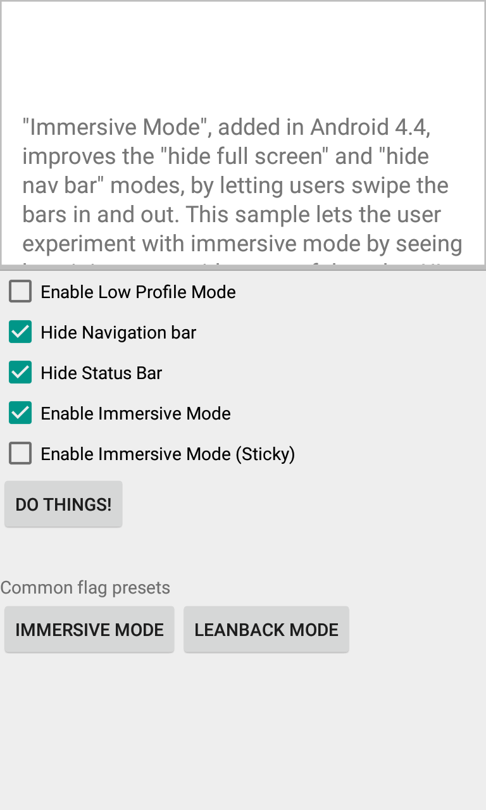

Android AdvancedImmersiveMode Sample
===================================

Immersive Mode, added in Android 4.4, improves the "hide full screen" and
"hide nav bar" modes by letting users swipe the bars in and out.  This sample
lets the user experiment with immersive mode by seeing how it interacts
with some of the other UI flags related to full-screen apps.

Introduction
------------

Android 4.4 (API Level 19) introduces a new `SYSTEM_UI_FLAG_IMMERSIVE`
flag for [setSystemUiVisibility()][1] that lets your app go truly "full
screen." This flag, when combined with the `SYSTEM_UI_FLAG_HIDE_NAVIGATION` and
`SYSTEM_UI_FLAG_FULLSCREEN` flags, hides the navigation and status bars
and lets your app capture all touch events on the screen.

When immersive full-screen mode is enabled, your activity continues
to receive all touch events. The user can reveal the system bars with
an inward swipe along the region where the system bars normally
appear.

[1]: http://developer.android.com/reference/android/view/View.html#setSystemUiVisibility(int)

Pre-requisites
--------------

- Android SDK 28
- Android Build Tools v28.0.3
- Android Support Repository

Screenshots
-------------

  

Getting Started
---------------

This sample uses the Gradle build system. To build this project, use the
"gradlew build" command or use "Import Project" in Android Studio.

Support
-------

- Stack Overflow: http://stackoverflow.com/questions/tagged/android

If you've found an error in this sample, please file an issue:
https://github.com/android/user-interface

Patches are encouraged, and may be submitted by forking this project and
submitting a pull request through GitHub. Please see CONTRIBUTING.md for more details.
