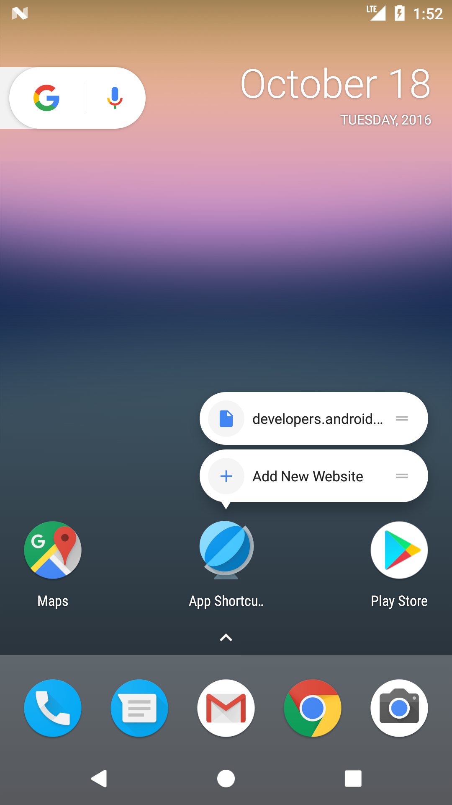

Android AppShortcuts Sample
===================================

This sample demonstrates how to use the Launcher Shortcuts API introduced in Android 7.1 (API 25).
This API allows an application to define a set of Intents which are displayed as when a user
long-presses on the app's launcher icon. Examples are given for registering both links both
statically in XML, as well as dynamically at runtime.

Introduction
------------

You can use the shortcuts feature in Android 7.1 (API 25) to bring users from the launcher
directly to key actions within your app. Users simply long-press your app's launcher icon
to reveal the app's shortcuts, then tap on a shortcut to jump to the associated action.
These shortcuts are a great way to engage users, and they let you surface the functionality
of your app even before users launch your app.

Each shortcut references an intent, each of which launches a specific action or task, and
you can create a shortcut for any action that you can express as an intent. For example, you
can create intents for sending a new text message, making a reservation, playing a video,
continuing a game, loading a map location, and much more.

You can create shortcuts for your app statically by adding them to a resource file in the APK,
or you can add them dynamically at runtime. Static shortcuts are ideal for common actions,
and dynamic shortcuts let you highlight actions based on users' preferences, behavior, location,
and so on. This sample demonstrates both types of shortcuts.

You can offer up to five shortcuts in each of your apps.

After your app adds shortcuts, they're available on any launcher that supports them, such as the
Pixel launcher (the default launcher on Pixel devices), the Now launcher (the default launcher on
Nexus devices), and other launchers that provide support.

For more information on creating shortcuts, see the [Shortcuts to App Actions][1] developer guide.

[1]: https://developer.android.com/preview/shortcuts.html

Pre-requisites
--------------

- Android SDK 28
- Android Build Tools v28.0.3
- Android Support Repository

Screenshots
-------------

 

Getting Started
---------------

This sample uses the Gradle build system. To build this project, use the
"gradlew build" command or use "Import Project" in Android Studio.

Support
-------

- Stack Overflow: http://stackoverflow.com/questions/tagged/android

If you've found an error in this sample, please file an issue:
https://github.com/android/user-interface

Patches are encouraged, and may be submitted by forking this project and
submitting a pull request through GitHub. Please see CONTRIBUTING.md for more details.
