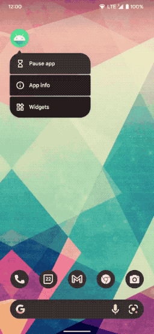
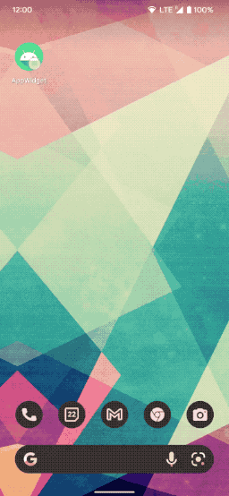
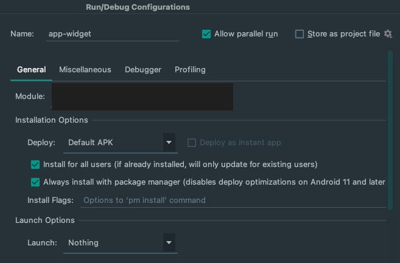

# AppWidget Sample

This sample demonstrates how to build Android AppWidgets with:

* [`RemoteViews`](https://developer.android.com/reference/android/widget/RemoteViews)
  and the [new Widgets APIs](https://developer.android.com/about/versions/12/features/widgets)
  introduced in [Android 12](https://developer.android.com/studio/releases/platforms#12)
  (API level 31) together with 
  [`core-remoteviews`](https://developer.android.com/jetpack/androidx/releases/core#core-remoteviews-1.0.0-alpha03)
  .
* [Glance](https://developer.android.com/jetpack/androidx/releases/glance) for app widgets.

The new set of APIs allows an application to build more engaging and beautiful widgets. Use this
sample together with the
[App widget guides](https://developer.android.com/guide/topics/appwidgets/overview).

# Pre-requisites

* Android 12 (API level 31)
* Android Studio Chipmunk or newer

# Getting Started

This sample uses the Gradle build system. To build this project, use the
"gradlew build" command or use "Import Project" in Android Studio.

The sample contains 3 type of widgets:

- ToDo list: showcasing how to create a list of items
- Buttons: showcasing how to use the new CompoundedButtons and handle click events
- Weather: showcasing a "real-life" weather widget.

Those are implemented in two packages:

- [rv](app/src/main/java/com/example/android/appwidget/rv) for RemoteViews implementation
- [glance](app/src/main/java/com/example/android/appwidget/glance) for Glance implementation

In addition, the [MainActivity](app/src/main/java/com/example/android/appwidget/MainActivity.kt)
showcases how to request the launcher to "pin" an appwidget.

> More showcasing resources in the [screenshots folder](screenshots)

## Run a new configuration

When creating a new run configuration, it's important to ensure that the widget is recreated without launching a new activity. Follow these steps to do so:

1. In Android Studio, select **Run > Edit Configurations**.
2. In the **Run/Debug Configurations** dialog, select **Always install with package manager...**.
3. Under **Launch Options**, in the **Launch** menu, select **Nothing**.

This will ensure that the widget is recreated but no activity is launched.

# Support

- Stack Overflow: https://stackoverflow.com/questions/tagged/glance-appwidget
- Channel #glance at KotlinLang
  Slack [(request to join)](https://surveys.jetbrains.com/s3/kotlin-slack-sign-up).

If you've found an error in this sample, please file an issue at https://github.com/android/user-interface.

For API-related issues, please file any bugs using the following links:

- For Glance: https://issuetracker.google.com/issues/new?component=1097239&template=1611667
- For Core Remote Views: https://issuetracker.google.com/issues/new?component=460834&template=1418393

We encourage patches. You may submit them by forking this project and submitting a pull request
through GitHub. Please see CONTRIBUTING.md for more details.
