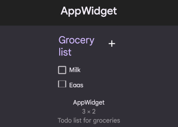
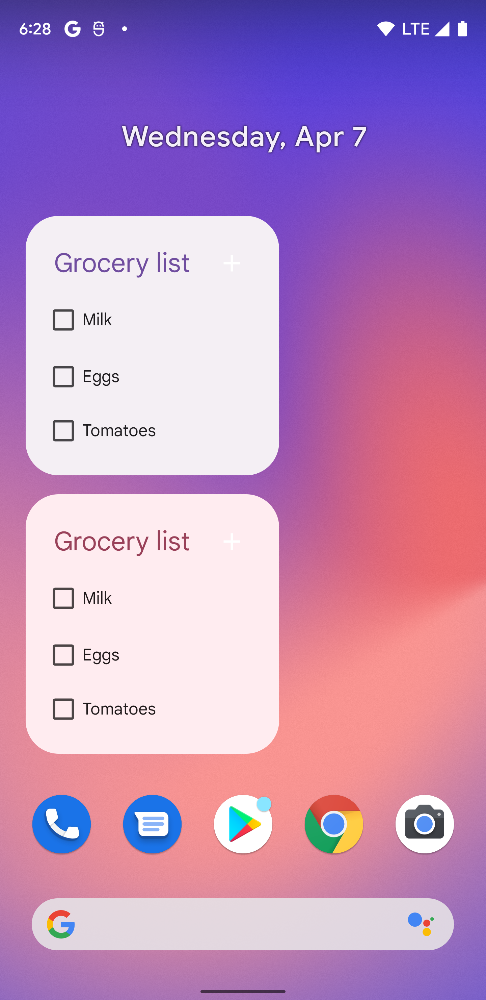
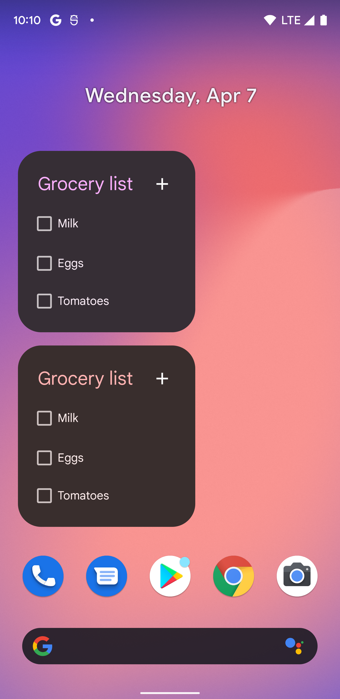
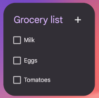
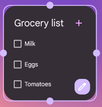
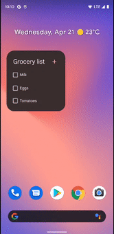
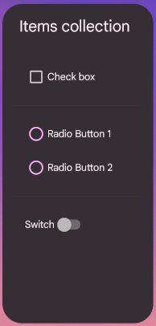
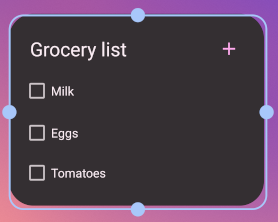
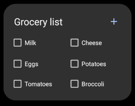

# AppWidget Sample

This sample demonstrates how to use the new Widgets APIs introduced in API level 31.
The new set of APIs allows an application to build more engaging and beautiful widgets.
The initial set of new APIs focuses on improving existing [`RemoteViews`](https://developer.android.com/reference/android/widget/RemoteViews) APIs.

## Improve your app's widget picker experience [(docs)](https://developer.android.com/about/versions/12/features/widgets#improve-widget-picker-experience)

### Add scalable widget previews to the widget picker [(docs)](https://developer.android.com/about/versions/12/features/widgets#add-scalable-widget-previews)

Starting in Android 12 the widget preview displayed in the widget picker consists of a scalable preview, which you’ll provide as an XML layout set to the widget's default size. Previously, the widget preview was a static drawable resource, in some cases leading to previews not accurately reflecting widgets after they were added to the home screen.

To implement scalable widget previews, use the [`previewLayout`](https://developer.android.com/reference/android/appwidget/AppWidgetProviderInfo#previewLayout) attribute of the `appwidget-provider` element to provide an XML layout instead:

[`app_widget_info_checkbox_list`](app/src/main/res/xml/app_widget_info_checkbox_list.xml\#L50)

```xml
<appwidget-provider
    android:previewLayout="@layout/widget_grocery_list"
    ... />
```

### Add a description for your widget [(docs)](https://developer.android.com/about/versions/12/features/widgets#add-widget-description)

In Android 12 you can optionally provide a description for the widget picker to display for your widget.

Provide a description for your widget using the description attribute of `appwidget-provider`:

[`app_widget_info_checkbox_list`](app/src/main/res/xml/app_widget_info_checkbox_list.xml\#L40)

```xml
<appwidget-provider
    android:description="@string/app_widget_grocery_list_description"
    ... />
```
  


## Apply dynamic colors [(docs)](https://developer.android.com/about/versions/12/features/widgets#dynamic-colors)

Starting in Android 12 a widget can use the device theme colors for buttons, backgrounds, and other components. This enables smoother transitions and consistency across different widgets.




## Backward-compatibility with dynamic colors [(docs)](https://developer.android.com/about/versions/12/features/widgets#backward-compatibility_with_dynamic_colors)
  
We recommend creating a custom theme and overriding it when running on devices with Android 12 or higher. The following examples show how to do this with various types of XML files:

[`values/themes.xml`](app/src/main/res/values/themes.xml\#L32)

```xml
<style name="Theme.AppWidget.AppWidgetContainer"
    parent="@android:style/Theme.DeviceDefault" />
```

[`values-v31/themes.xml`](app/src/main/res/values-v31/themes.xml\#L22)

```xml
<style name="Theme.AppWidget.AppWidgetContainer"
    parent="@android:style/Theme.DeviceDefault.DayNight" />
```

[`values-night-v31/themes.xml`](app/src/main/res/values-night-v31/themes.xml\#L20)

```xml
<!-- Having themes.xml for night-v31 because of the priority order of the resource qualifiers. -->
<style name="Theme.AppWidget.AppWidgetContainer"
    parent="@android:style/Theme.DeviceDefault.DayNight" />
```

[`layout/widget_grocery_list.xml`](app/src/main/res/layout/widget_grocery_list.xml\#L21)

```xml
<LinearLayout
    android:theme="@style/Theme.AppWidget.AppWidgetContainer">
  ...
</LinearLayout>
```

## Implement rounded corners [(docs)](https://developer.android.com/about/versions/12/features/widgets#rounded-corner)

Android 12 introduces the following system parameters to set the radii of your widget's rounded corners:

* `system_app_widget_background_radius`: The corner radius of the widget background, which will never be larger than 28dp.
* `system_app_widget_inner_radius`: The corner radius of any view inside the widget. This is exactly 8dp less than the background radius to align nicely when using an 8dp padding.

### Backward-compatibility with rounded corners [(docs)](https://developer.android.com/about/versions/12/features/widgets#backward-compatibility_with_rounded_corners)

To ensure widget compatibility with previous versions of Android, we recommend defining custom attributes and using a custom theme to override them for Android 12 or higher, as shown in the following examples of XML files:

[`values/attrs.xml`](app/src/main/res/values/attrs.xml\#L16)

```xml
<declare-styleable name="AppWidgetAttrs">
    <attr name="appWidgetPadding" format="dimension" />
    <attr name="appWidgetInnerRadius" format="dimension" />
    <attr name="appWidgetRadius" format="dimension" />
</declare-styleable>
```

[`values/themes.xml`](app/src/main/res/values/themes.xml\#L32)

```xml
<style name="Theme.AppWidget.AppWidgetContainerParent" parent="@android:style/Theme.DeviceDefault">
    <!-- Radius of the outer bound of widgets to make the rounded corners -->
    <item name="appWidgetRadius">16dp</item>
    <!--
    Radius of the inner view's bound of widgets to make the rounded corners.
    It needs to be 8dp or less than the value of appWidgetRadius
    -->
    <item name="appWidgetInnerRadius">8dp</item>
</style>

<style name="Theme.AppWidget.AppWidgetContainer" parent="Theme.AppWidget.AppWidgetContainerParent">
    <!-- Apply padding to avoid the content of the widget colliding with the rounded corners -->
    <item name="appWidgetPadding">16dp</item>
</style>
```

[`values-v31/themes.xml`](app/src/main/res/values-v31/themes.xml\#L22)

```xml
<style name="Theme.AppWidget.AppWidgetContainerParent" parent="@android:style/Theme.DeviceDefault.DayNight">
    <item name="appWidgetRadius">@android:dimen/system_app_widget_background_radius</item>
    <item name="appWidgetInnerRadius">@android:dimen/system_app_widget_inner_radius</item>
</style>
```

[`values/styles.xml`](app/src/main/res/values/styles.xml\#L18)

```xml
<style name="Widget.AppWidget.AppWidget.Container" parent="android:Widget">
    <item name="android:id">@android:id/background</item>
    <item name="android:background">?android:attr/colorBackground</item>
</style>
```

[`values-v21/styles.xml`](app/src/main/res/values-v21/styles.xml\#L21)

```xml
<!--
  Having styles for v21 because specifying android:attr/colorBackground used in the drawables
  requires API level 21
-->
<style name="Widget.AppWidget.AppWidget.Container" parent="android:Widget">
    <item name="android:padding">?attr/appWidgetPadding</item>
    <item name="android:background">@drawable/app_widget_background</item>
</style>
```

[`drawable-v21/app_widget_background.xml`](app/src/main/res/drawable-v21/app_widget_background.xml\#L21)

```xml
<shape xmlns:android="http://schemas.android.com/apk/res/android"
  android:shape="rectangle">

    <corners android:radius="?attr/appWidgetRadius" />
    <solid android:color="?android:attr/colorBackground" />
</shape>>
```

[`layout/widget_checkbox_list.xml`](app/src/main/res/layout/widget_checkbox_list.xml\#L17)

```xml
layout/widget_layout.xml
<LinearLayout
  style="@style/Widget.AppWidget.AppWidget.Container">
  ...
</LinearLayout>
```



## Make it easier to personalize widgets [(docs)](https://developer.android.com/about/versions/12/features/widgets#personalize-widgets)

If you specify a configuration activity with the [`configure`](https://developer.android.com/reference/android/appwidget/AppWidgetProviderInfo#configure) attribute of [`appwidget-provider`](https://developer.android.com/reference/android/appwidget/AppWidgetProviderInfo), the App Widget host launches that activity immediately after a user adds the widget to their home screen.

Android 12 adds new options to let you provide a better configuration experience for users.

### Enable users to reconfigure placed widgets [(docs)](https://developer.android.com/about/versions/12/features/widgets#reconfigure-widgets)

To configure widgets that are labeled as reconfigurable, users can long-press the widget. This displays a **Reconfigure** button, which they can tap to change settings.



Specify the `reconfigurable` flag in the `widgetFeatures` attribute of `appwidget-provider`:

[`xml/app_widget_info_checkbox_list.xml`](app/src/main/res/xml/app_widget_info_checkbox_list.xml\#L39)

```xml
<appwidget-provider
    android:configure="com.example.android.appwidget.ListWidgetConfigureActivity"
    android:widgetFeatures="reconfigurable"
    ... />
```
  
### Use the widget's default configuration [(docs)](https://developer.android.com/about/versions/12/features/widgets#use-default)

If you’d like your widget to use its default configuration when a user adds it, you can skip the configuration step by specifying both the `configuration_optional` and `reconfigurable` flags in the `widgetFeatures` field.

```xml
<appwidget-provider
    android:configure="com.example.android.appwidget.ListWidgetConfigureActivity"
    android:widgetFeatures="reconfigurable|configuration_optional"
    ... />
```

## Enable smoother transitions [(docs)](https://developer.android.com/about/versions/12/features/widgets#enable-smoother-transitions)

Starting in Android 12 launchers provide a smoother transition when a user launches your app from a widget.

To enable this improved transition, use [`android:id/background`](https://developer.android.com/reference/android/R.id#background)  or `android.R.id.background` to identify your background element:

```xml
<LinearLayout
  android:id="@android:id/background">
  ...
</LinearLayout>
```



## Add new compound buttons [(docs)](https://developer.android.com/about/versions/12/features/widgets#new-compound-buttons)

Android 12 adds new support for stateful behavior using the following existing components:

* [`Checkbox`](https://developer.android.com/reference/kotlin/android/widget/CheckBox)
* [`Switch`](https://developer.android.com/reference/kotlin/android/widget/Switch)
* [`RadioButton`](https://developer.android.com/reference/kotlin/android/widget/RadioButton)



The widget itself is still stateless, so you need to store the state and register a listener for the state change events.

[`ItemsCollectionAppWidget.kt`](app/src/main/java/com/example/android/appwidget/ItemsCollectionAppWidget.kt\#L139)

```kotlin
// This code will check the Checkbox
remoteViews.setCompoundButtonChecked(R.id.item_checkbox, true)
```

[`ItemsCollectionAppWidget.kt`](app/src/main/java/com/example/android/appwidget/ItemsCollectionAppWidget.kt\#L142)

```kotlin
// This code will check the item_radio_button2 in the item_radio_group RadioGroup
remoteViews.setRadioGroupChecked(R.id.item_radio_group, R.id.item_radio_button2))
```

[`ItemsCollectionAppWidget.kt`](app/src/main/java/com/example/android/appwidget/ItemsCollectionAppWidget.kt\#L162)

```kotlin
// Listen for change events.
// RemoteResponse.fromPendingIntent works on an individual item whereas you can set
// a PendingIntent template using RemoteViews.setPendingIntentTemplate and
// distinguish individual on-click by calling RemoteResponse.fromFillInIntent.
remoteViews.setOnCheckedChangeResponse(
  R.id.item_switch,
  RemoteViews.RemoteResponse.fromPendingIntent(onCheckedChangePendingIntent)
)
remoteViews.setOnCheckedChangeResponse(
  R.id.item_switch,
  RemoteViews.RemoteResponse.fromFillInIntent(onCheckedChangeFillInIntent)
)
```

See the documentation for [`fromPendingIntent`](https://developer.android.com/reference/android/widget/RemoteViews.RemoteResponse#fromPendingIntent(android.app.PendingIntent)) and [`fromFillInIntent`](https://developer.android.com/reference/android/widget/RemoteViews.RemoteResponse#fromFillInIntent(android.content.Intent)) for more details.

## Use simplified RemoteViews collections [(docs)](https://developer.android.com/about/versions/12/features/widgets#leverage-simplified-remoteview-collections)

Android 12 adds the `setRemoteAdapter(int viewId, RemoteViews.RemoteCollectionItems items)` method, which lets your app pass along a collection directly when populating a `ListView`. Previously, when using a `ListView`, it was necessary to implement and declare a [`RemoteViewService`](https://developer.android.com/reference/android/widget/RemoteViewsService) to return [`RemoteViewsFactory`](https://developer.android.com/reference/android/widget/RemoteViewsService.RemoteViewsFactory).

If the collection doesn’t use a constant set of layouts (in other words, if some items are only sometimes present), use `setViewTypeCount` to specify the maximum number of unique layouts the collection can contain.

Here’s an example of how to implement simplified `RemoteViews` collections.

[`ItemsCollectionAppWidget.kt`](app/src/main/java/com/example/android/appwidget/ItemsCollectionAppWidget.kt\#L51)

```kotlin
remoteViews.setRemoteAdapter(
  R.id.items_list_view, 
  RemoteViews.RemoteCollectionItems.Builder()
    .addItem(/* id= */ ID_1, RemoteViews(...))
    .addItem(/* id= */ ID_2, RemoteViews(...))
    ...
    .setViewTypeCount(MAX_NUM_DIFFERENT_REMOTE_VIEWS_LAYOUTS)
    .build()
)
```

## Use improved APIs for widget sizes and layouts [(docs)](https://developer.android.com/about/versions/12/features/widgets#refine-widget-sizes)

Starting in Android 12 you can provide more refined size attributes and more flexible layouts and by doing the following:

1. [Specify additional widget sizing constraints](#specify-additional-widget-sizing-constraints)
1. [Provide responsive layouts](#provide-responsive-layouts) or [exact layouts](https://developer.android.com/about/versions/12/features/widgets#provide-exact-layouts)

### Specify additional widget sizing constraints [(docs)](https://developer.android.com/about/versions/12/features/widgets#specify-widget-size-constraints)

Android 12 adds new APIs allowing you to ensure your widget is sized more reliably across different devices with varying screen sizes.

In addition to the existing [`minWidth`](https://developer.android.com/reference/android/appwidget/AppWidgetProviderInfo#minWidth), [`minHeight`](https://developer.android.com/reference/android/appwidget/AppWidgetProviderInfo#minHeight), [`minResizeWidth`](https://developer.android.com/reference/android/appwidget/AppWidgetProviderInfo#minResizeWidth), and [`minResizeHeight`](https://developer.android.com/reference/android/appwidget/AppWidgetProviderInfo#minResizeHeight) attributes, use the following new appwidget-provider attributes:

* [`targetCellWidth`](https://developer.android.com/reference/android/appwidget/AppWidgetProviderInfo#targetCellWidth) and [`targetCellHeight`](https://developer.android.com/reference/android/appwidget/AppWidgetProviderInfo#targetCellHeight): Defines the target size of the widget in terms of launcher grid cells. If defined, these attributes are used instead of minWidth or minHeight.
* [`maxResizeWidth`](https://developer.android.com/reference/android/appwidget/AppWidgetProviderInfo#maxResizeWidth) and [`maxResizeHeight`](https://developer.android.com/reference/android/appwidget/AppWidgetProviderInfo#maxResizeHeight): Defines the maximum size the launcher allows the user to resize the widget.

The following XML describes how to use the sizing attributes.

[`xml/app_widget_info_checkbox_list.xml`](app/src/main/res/xml/app_widget_info_checkbox_list.xml\#L38)

```xml
<appwidget-provider
  android:maxResizeWidth="240dp"
  android:maxResizeHeight="220dp"
  android:minWidth="180dp"
  android:minHeight="180dp"
  android:minResizeWidth="180dp"
  android:minResizeHeight="180dp"
  android:targetCellWidth="3"
  android:targetCellHeight="3"
  ... />
```



### Provide responsive layouts [(docs)](https://developer.android.com/about/versions/12/features/widgets#provide-responsive-layouts)

If the layout needs to change depending on the size of the widget, we recommend creating a small set of layouts, each valid for a range of sizes. (If this isn’t possible, another option is to provide layouts based on the exact widget size at runtime.)

Implementing this feature allows for smoother scaling and overall better system health; this is because the system doesn't have to wake up the app every time it displays the widget in a different size.

The following code examples show how to provide a list of layouts.

[`ListAppWidget.kt`](app/src/main/java/com/example/android/appwidget/ListAppWidget.kt\#L94)

```kotlin
val viewMapping: MutableMap<SizeF, RemoteViews> = mutableMapOf()
// Specify the maximum width and height in dp and a layout, which you want to use for the
// specified size
val viewMapping = mapOf(
    SizeF(150f, 150f) to RemoteViews(
        context.packageName,
        R.layout.widget_grocery_list
    ),
    SizeF(250f, 150f) to RemoteViews(
        context.packageName,
        R.layout.widget_grocery_grid
    ),
)
appWidgetManager.updateAppWidget(appWidgetId, RemoteViews(viewMapping))
```




# Pre-requisites

* Android SDK 31

# Getting Started

This sample uses the Gradle build system. To build this project, use the
"gradlew build" command or use "Import Project" in Android Studio.

# Support

- Stack Overflow: http://stackoverflow.com/questions/tagged/android

If you've found an error in this sample, please file an issue:
https://github.com/android/user-interface

Patches are encouraged, and may be submitted by forking this project and
submitting a pull request through GitHub. Please see CONTRIBUTING.md for more details.
