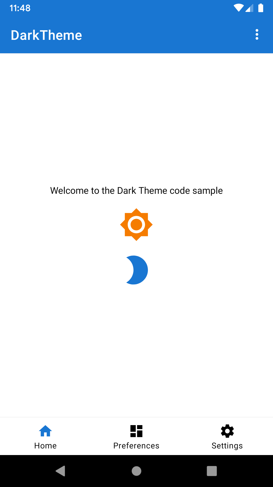
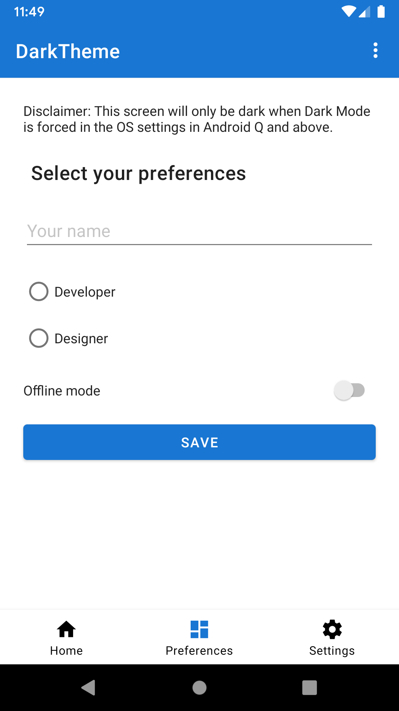
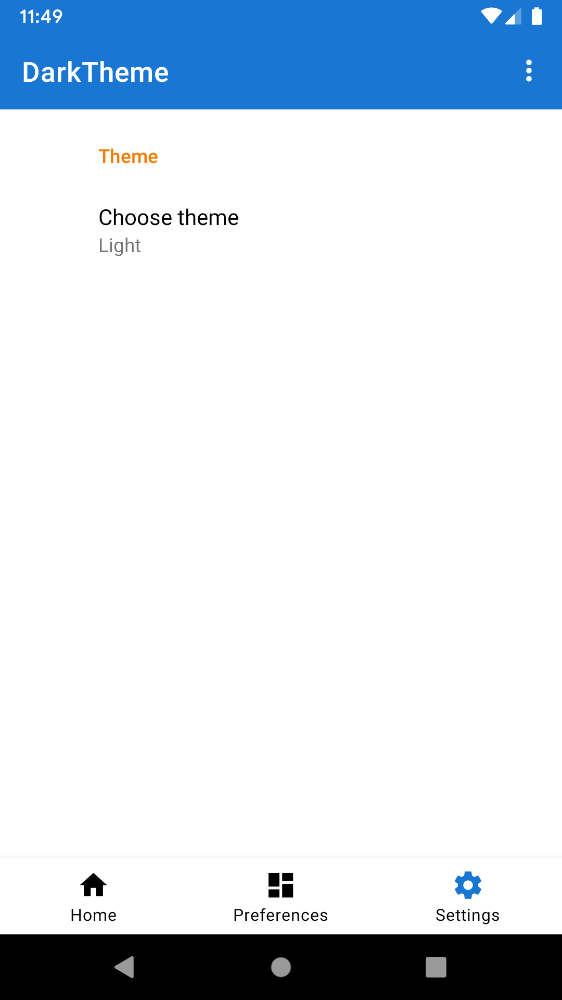
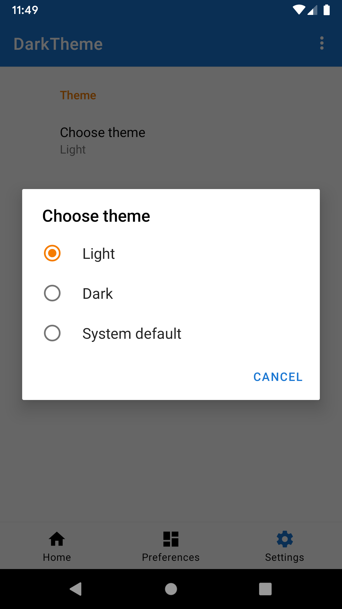
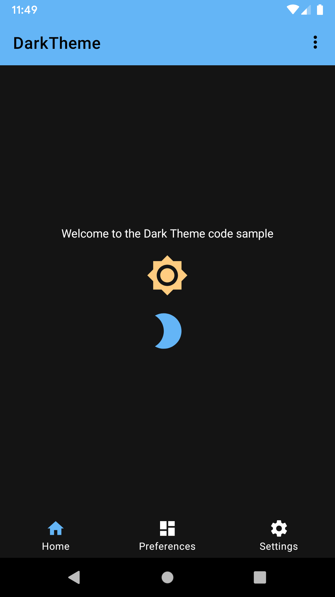
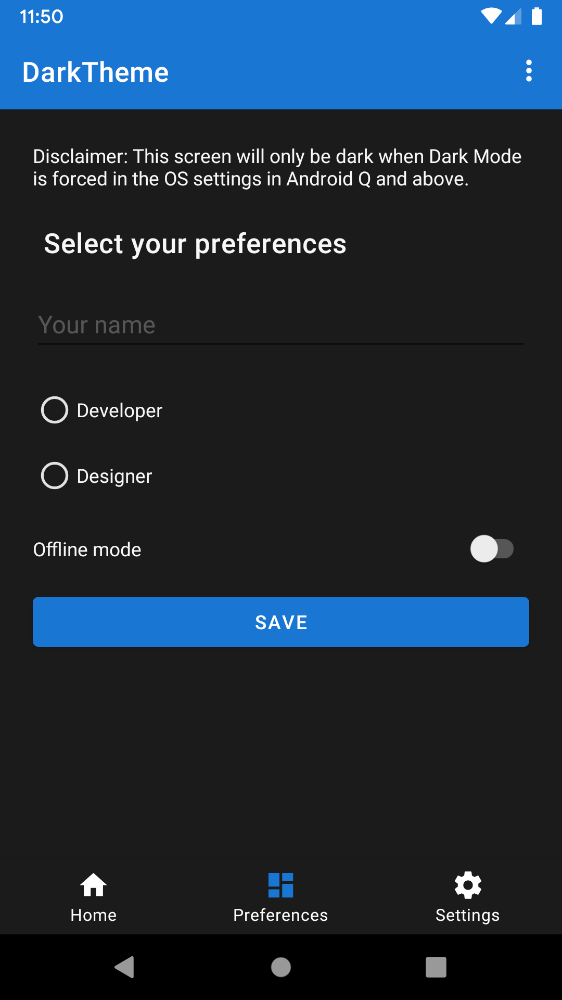
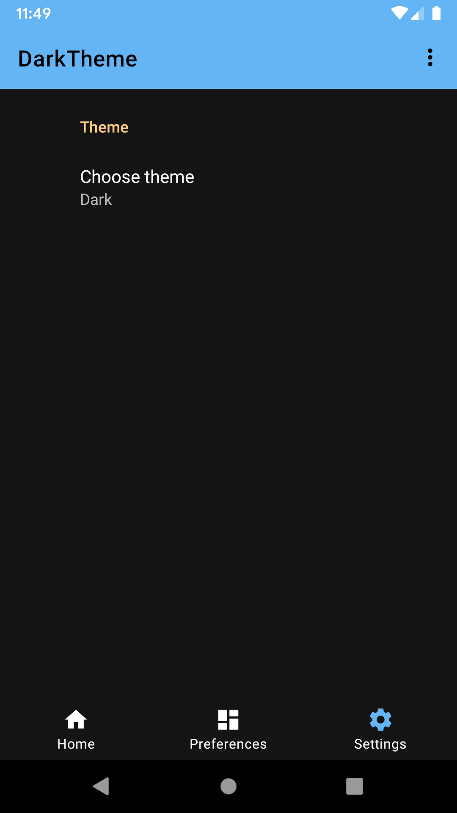
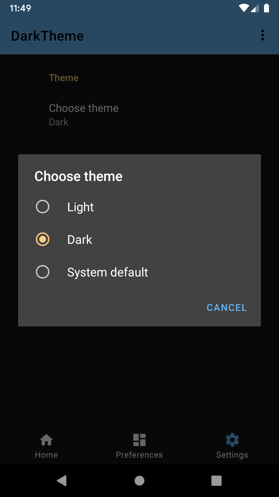

Android DarkTheme Sample
=====================

Sample demonstrating the different ways to support Dark Mode on Android.
            Uses the Material Design Components Library.

Introduction
------------

Android Q has explicit user support for Dark Mode, allowing users to choose
whether the device theme is dark or not. There are multiple ways you can allow
Dark Mode in your app:

### Night mode in AppCompat and Material Components

AppCompat has had "night mode" APIs for a number of years now. It allows developers to
implement dark mode in their apps using the -night resource qualifier. The [Material Design
Components library][1] builds upon AppCompat and exposes its own DayNight themes.

The DayNight theme in the AndroidX Material Components library provides Dark Theme backwards
compatibility down to API 14. The theme we use in the app (specified in `AndroidManifest.xml#L23`)
extends from DayNight (`values/styles.xml#L16`).

Use theme-defined colours when defining colours for your drawables.
For example, we use `?attr/colorOnBackground` for the generic text color of the app (`values/styles.xml#35`).

When it's not possible to use theme-defined colours, you can use the -night qualifier to
extract hard-coded values and switch them out when the configuration changes to night mode.
For example, we use a different primary colour in dark mode. Check `values-night/colors.xml`
for more details. You can also specify custom drawables creating a drawable-night folder.

Tell AppCompat what mode to use by calling [`AppCompatDelegate.setDefaultNightMode()`][2] or
`getDelegate().setLocalNightMode()`. It can take different values:
- MODE_NIGHT_YES. Always use the dark theme.
- MODE_NIGHT_NO. Always use the light theme (Smart Dark can override it).
- MODE_NIGHT_FOLLOW_SYSTEM. Follows the current system setting
- MODE_NIGHT_AUTO_BATTERY. Dark when battery saver is enabled, light otherwise.

In the code sample, you can find the code related to this in the `ThemeHelper` class.

### Smart Dark

Smart Dark is a new feature in Android Q which can automatically theme a light app to
dark by dynamically re-coloring the app being drawn at runtime. It has no direct developer
APIs. It is made for apps which do not have explicit Dark Theme support yet.

Smart Dark applies to any theme whose value of `android:isLightTheme=true`. This is set on
all of the `Theme.*.Light.*` variants, including those from AppCompat. You can opt-in and opt-out at
both a theme and view level. Opt-in by setting `android:forceDarkAllowed="true"`
in the view or theme. Alternatively, you can enable/disable it in the code by calling
`View#setForceDarkAllowed(boolean)`.

This feature is implemented in the `PreferencesFragment`. As you can see in the
`layout/fragment_preferences.xml` file, all colours are hard-coded to be light-theme suitable.
To make it use Smart Dark, the parent view sets `android:forceDarkAllowed="true"`
(you can see it in `layout/fragment_preferences.xml#L19`). In this case, when Smart Dark is
active, this screen will be automatically themed to be dark-mode friendly. The system will
change most of the colours to make that happen.

## Dark Mode in the code sample

The user can decide which theme to use within the app. In the Settings screen, the user
can choose the Light theme, Dark theme, or System Default (when the app is running on
Android Q+) or Set by Battery Saver (when running on Android P or earlier). When using the
System Default option, the system decides the theme based on the Platform System Settings
introduced in Android Q.

These options, that are also listed above, are the settings that Google recommends.
Also, it recommends that this user choice is stored and applied whenever the user opens
the app again. In the code sample, the user preference is automatically stored in
`SharedPreferences` because we use the androidX preference library. Check `SettingsFragment`
and `preferences.xml` for more information about it. In the `DarkThemeApplication` class,
we retrieve and apply the user theme preference when the user opens the app.

Notice that the PreferencesFragment will be only in Dark Mode when the Smart Dark is active.
You can force it by running `adb shell setprop debug.hwui.force_dark true` on your terminal console.

## Hands on

In the sample, we make views Dark-Mode friendly in different ways:

- *Vectors using tints*. `drawable/ic_brightness_2.xml` is Dark-Mode friendly by
using the `android:tint` attribute.

- *Vectors using hard-coded colours*. `drawable/ic_brightness.xml` is Dark-Mode friendly by
setting its View tint in `fragment_welcome.xml#L38`. Also, you can set it programmatically
as we do with the tinted menu icon `R.id.action_more`.

- *Tinted menu icons*. `R.id.action_more` is tinted programmatically in `MainActivity.java#L85`.

- *Different colorPrimary/colorsecondary for light/dark mode*. We define the primary color
in `values/styles.xml#L21` where we set "colorPrimary" to `@color/primary`.
`@color/primary` is defined in both `values/colors.xml` and `values-night/colors.xml`.

- *Text color*. Same way as we did before, the text color is defined in `values/styles.xml`
with the `"android:textColorPrimary"` attribute.

- *Window background*. The window background is set in `values/styles.xml` with the
`"android:windowBackground"` attribute. The value is set to `@color/background` so if
Dark Mode is enabled the splash screen is black instead of white.

- *Apply variations to a color using ColorStateList*. Check out `color/color_on_primary_mask.xml`.
Instead of creating a new color with an alpha in hexadecimal values, we reuse the color and specify
the alpha with a percentage number.

- *Enable Smart Dark*. The `PreferenceFragment` is not Dark-Mode friendly. It has all colours
hard-coded to be suitable for light mode. To opt the Fragment in for Smart Dark, we set
`android:forceDarkAllowed="true"` in the root View of the Fragment. You can find the code
in `layout/fragment_preferences.xml#19`.

[1]: https://material.io/develop/android/docs/getting-started/
[2]: https://developer.android.com/reference/android/support/v7/app/AppCompatDelegate#setdefaultnightmode

Pre-requisites
--------------

- Android SDK 28
- Android Build Tools v28.0.3
- Android Support Repository

Screenshots
-------------

        

Getting Started
---------------

This sample uses the Gradle build system. To build this project, use the
"gradlew build" command or use "Import Project" in Android Studio.

Support
-------

- Stack Overflow: http://stackoverflow.com/questions/tagged/android

If you've found an error in this sample, please file an issue:
https://github.com/android/user-interface-samples

Patches are encouraged, and may be submitted by forking this project and
submitting a pull request through GitHub. Please see CONTRIBUTING.md for more details.
