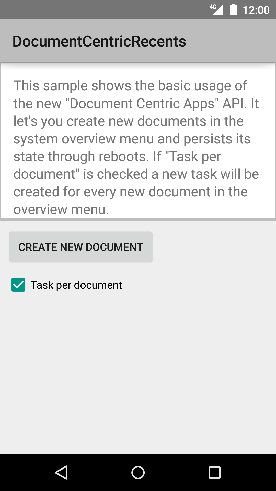
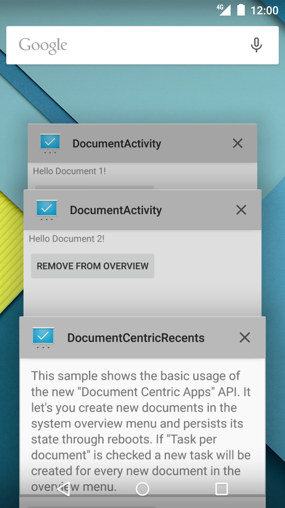

Android DocumentCentricRecents Sample
=====================================

Sample demonstrating the basic usage of the new 'Document Centric Apps' API.
It let's you create new documents in the system overview menu and persists its
state through reboots.

Introduction
------------

This sample shows the basic usage of the new Document-Centric Apps API. The new
API modifies the meaning of the Intent#FLAG_ACTIVITY_CLEAR_WHEN_TASK_RESET flag, which is
now deprecated. In versions before L it serves to define a boundary between the main task and a
subtask. The subtask holds a different thumbnail and all activities in it are finished when the
task is reset. In L this flag causes a full break with the task that launched it. As such it has
been renamed to Intent#FLAG_ACTIVITY_NEW_DOCUMENT.

This sample mainly uses Intent flags in code. But Activities can also specify in their manifests
that they shall always be launched into a new task in the above manner using the new activity
attribute documentLaunchMode which may take on one of three values, “intoExisting” equivalent to
NEW_DOCUMENT, “always” equivalent to NEW_DOCUMENT | MULTIPLE_TASK, “none” the default, and
“never” which will negate the effect of any attempt to launch the activity with NEW_DOCUMENT.

Pre-requisites
--------------

- Android SDK 28
- Android Build Tools v28.0.3
- Android Support Repository

Screenshots
-------------

  

Getting Started
---------------

This sample uses the Gradle build system. To build this project, use the
"gradlew build" command or use "Import Project" in Android Studio.

Support
-------

- Stack Overflow: http://stackoverflow.com/questions/tagged/android

If you've found an error in this sample, please file an issue:
https://github.com/android/user-interface

Patches are encouraged, and may be submitted by forking this project and
submitting a pull request through GitHub. Please see CONTRIBUTING.md for more details.
