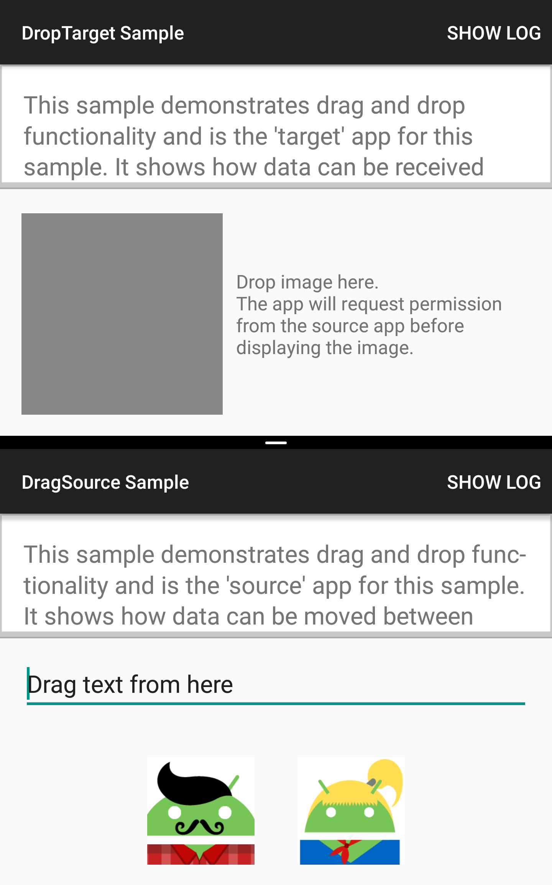
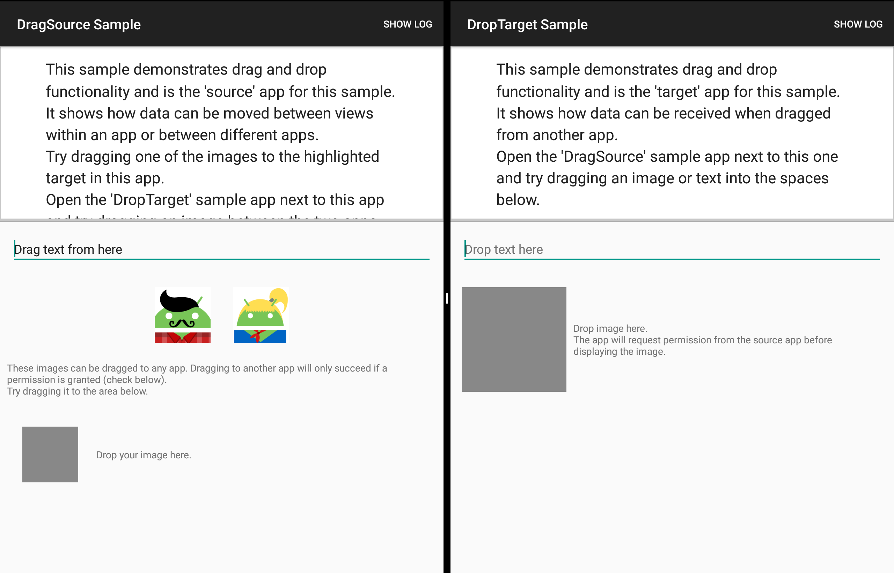

Android DragAndDropAcrossApps-new Sample
===================================

This sample contains two separate Android applications: DragSource and
DropTarget. DragSource contains images and text that can be dropped into the DropTarget
app. Images are shared between the two apps through a URI for which the receiving app
must request permission first, before it can be used.

It also demonstrates the use of the DragStartHelper from the v13 support library to easily
handle drag and drop events.

Introduction
------------

Android N introduces support for drag and drop between applications,
augmenting the existing APIs that have enabled this within a single
window before.

To start a drag operation you need to call `View.startDragAndDrop`.
Which gesture or action triggers this is up to you as an app developer.
The API guide recommends doing this from
`View.OnLongClickListener.onLongClick` and this seems to be the de-facto
standard, but you are free to use other gestures (single tap, tap and drag
etc).
However, if you go for a unconventional drag start gesture, note that
the framework implementation assumes that the pointer (touch or mouse)
is down while the drag is starting, and the most recent touch/click
position is used as the original position of the drag shadow.

See also `android.support.v13.view.DragStartHelper` which uses different
gestures for touch and mouse (click and drag works better for mouse
than a long click).

By default a drag and drop operation is constrained by the window
containing the view that started the drag.
To enable cross-window and cross-app drag and drop add
`View.DRAG_FLAG_GLOBAL` to the flags passed to the `View.startDragAndDrop`
call.

If a Uri requiring permission grants is being sent, then the
`android.view.View.DRAG_FLAG_GLOBAL_URI_READ` and/or the
`android.view.View.DRAG_FLAG_GLOBAL_URI_WRITE` flags must be used also.
To access content URIs requiring permissions on the receiving side, the target
app needs to request the `android.view.DropPermissions` from the activity via
`android.app.Activity.requestDropPermissions`. This permission will stay either
until the activity is alive, or until the `release()` method is called on the
`android.view.DropPermissions` object.

Pre-requisites
--------------

- Android SDK 28
- Android Build Tools v28.0.3
- Android Support Repository

Screenshots
-------------

  

Getting Started
---------------

This sample uses the Gradle build system. To build this project, use the
"gradlew build" command or use "Import Project" in Android Studio.

Support
-------

- Stack Overflow: http://stackoverflow.com/questions/tagged/android

If you've found an error in this sample, please file an issue:
https://github.com/android/user-interface

Patches are encouraged, and may be submitted by forking this project and
submitting a pull request through GitHub. Please see CONTRIBUTING.md for more details.
