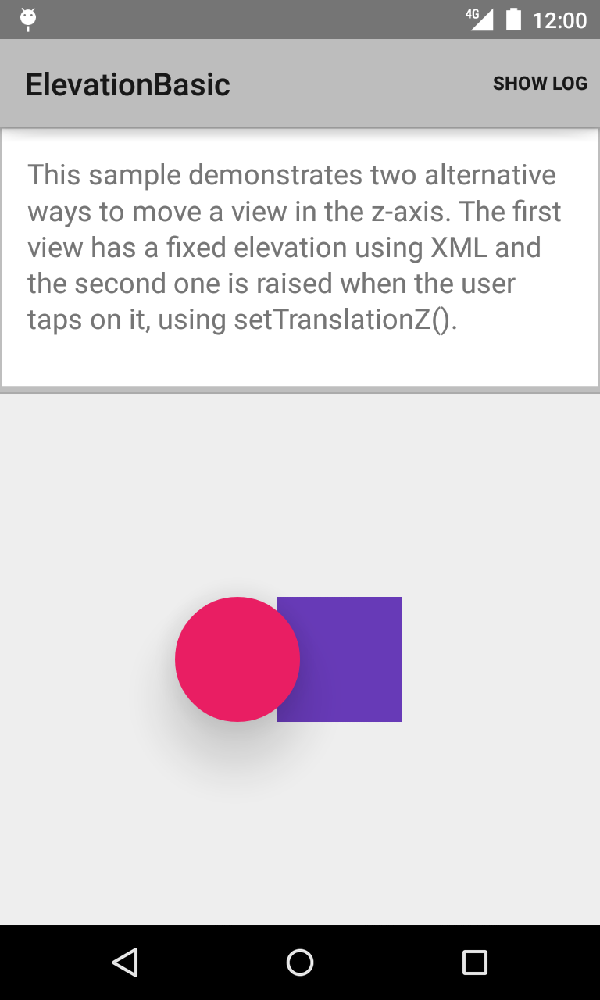
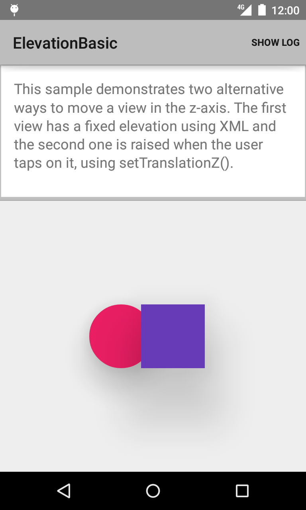

Android ElevationBasic Sample
===================================

This sample demonstrates ways to move a view in the z-axis using
`setTranslationZ()`. This method was introduced in API Level 21 ('Lollipop').

Introduction
------------

This sample uses two shapes, a circle and a square, and it demonstrates two
alternative ways to move a view in the z-axis. The first shape, the circle,
has a fixed elevation, which is defined in XML. The second view, the square,
changes its elevation using [setTranslationZ()][1] when a user touches it:

    shape2.setOnTouchListener(new View.OnTouchListener() {
        @Override
        public boolean onTouch(View view, MotionEvent motionEvent) {
            int action = motionEvent.getActionMasked();
            /* Raise view on ACTION_DOWN and lower it on ACTION_UP. */
            switch (action) {
                case MotionEvent.ACTION_DOWN:
                    Log.d(TAG, "ACTION_DOWN on view.");
                    view.setTranslationZ(120);
                    break;
                case MotionEvent.ACTION_UP:
                    Log.d(TAG, "ACTION_UP on view.");
                    view.setTranslationZ(0);
                    break;
                default:
                    return false;
            }
            return true;
        }
    });

The elevation reverts back once the touch is removed.

[1]: https://developer.android.com/training/material/shadows-clipping.html#Elevation

Pre-requisites
--------------

- Android SDK 28
- Android Build Tools v28.0.3
- Android Support Repository

Screenshots
-------------

  

Getting Started
---------------

This sample uses the Gradle build system. To build this project, use the
"gradlew build" command or use "Import Project" in Android Studio.

Support
-------

- Stack Overflow: http://stackoverflow.com/questions/tagged/android

If you've found an error in this sample, please file an issue:
https://github.com/android/user-interface

Patches are encouraged, and may be submitted by forking this project and
submitting a pull request through GitHub. Please see CONTRIBUTING.md for more details.
