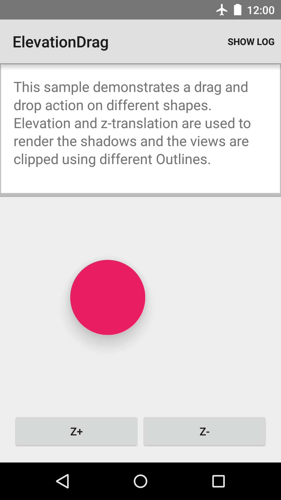

Android ElevationDrag Sample
===================================

This sample demonstrates a drag and drop action on different shapes. Elevation and
z-translation are used to render the shadows and the views are clipped using different
Outlines.

Introduction
------------

This sample demonstrates a drag and drop action on different shapes. Elevation and
z-translation are used to render the shadows and the views are clipped using different
Outlines.

Elevation is considered the static or initial position of a view on the z axis, while
translationZ exists for transient states, like animations.

`Z = elevation + translationZ`

See [Assign Elevation to Your Views][1] for more info.
[1]:https://developer.android.com/training/material/shadows-clipping.html#Elevation

Pre-requisites
--------------

- Android SDK 28
- Android Build Tools v28.0.3
- Android Support Repository

Screenshots
-------------

 

Getting Started
---------------

This sample uses the Gradle build system. To build this project, use the
"gradlew build" command or use "Import Project" in Android Studio.

Support
-------

- Stack Overflow: http://stackoverflow.com/questions/tagged/android

If you've found an error in this sample, please file an issue:
https://github.com/android/user-interface

Patches are encouraged, and may be submitted by forking this project and
submitting a pull request through GitHub. Please see CONTRIBUTING.md for more details.
