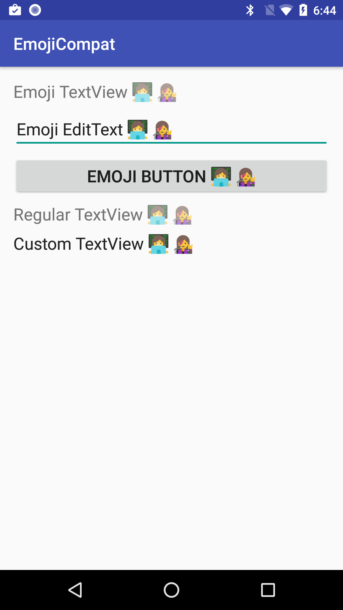

Android EmojiCompat Sample (Kotlin)
===================================

This sample demonstrates usage of EmojiCompat support library. You can use this library
to prevent your app from showing missing emoji characters in the form of tofu (□). You
can use either bundled or downloadable emoji fonts. This sample shows both usages.

Introduction
------------

The EmojiCompat support library aims to keep Android devices up to date with the latest emoji. It
prevents your app from showing missing emoji characters in the form of ☐, which indicates that your
device does not have a font to display the text. By using the EmojiCompat support library, your app
users do not need to wait for Android OS updates to get the latest emoji.

For further detail, read [Emoji Compatibility][1] documentation.

### Configuration

You need to first initialize EmojiCompat to load the metadata and the typeface. You can use either
bundled or downloadable fonts.

#### Use downloadable fonts

***You need the beta version of Google Play Services to use this feature.*** Join
[Google Play Services Public Beta Program][4] and make sure you have v11 installed on your device
running Android O Developer Preview 2.

For the downloadable font configuration, you need to create an instance of the [FontRequest][5]
class, and provide the font provider authority, the font provider package, the font query, and a
list of set of hashes for the certificates. For more information about FontRequest, refer to the
Downloadable Fonts documentation. You can then create an instance of
[FontRequestEmojiCompatConfig][6] and pass it to EmojiCompat.init().

```java
final FontRequest fontRequest = new FontRequest(
                    "com.google.android.gms.fonts",
                    "com.google.android.gms",
                    "Noto Color Emoji Compat",
                    R.array.com_google_android_gms_fonts_certs);
EmojiCompat.init(new FontRequestEmojiCompatConfig(getApplicationContext(), fontRequest)
                    .setReplaceAll(true)
                    .registerInitCallback(new EmojiCompat.InitCallback() {
                        @Override
                        public void onInitialized() {
                            Log.i(TAG, "EmojiCompat initialized");
                        }

                        @Override
                        public void onFailed(@Nullable Throwable throwable) {
                            Log.e(TAG, "EmojiCompat initialization failed", throwable);
                        }
                    });)
```

#### Use bundled font

In order the use the bundled font, call init() method of [EmojiCompat][2] with an instance of
[BundledEmojiCompatConfig][3].

### Use EmojiCompat

#### Built-in views

The easiest way to use EmojiCompat in your layout, is to use [EmojiAppCompatTextView][7],
[EmojiAppCompatEditText][8], or [EmojiAppCompatButton][9]. You can use them in your layout XMLs or
code. You can just set any text containing emoji and the widgets handle the rest.

#### With regular TextViews

If you want to use EmojiCompat with a regular TextView, retrieve an instance of EmojiCompat by
calling EmojiCompat.get() and call registerInitCallback method. You can pass an
EmojiCompat.InitCallback and use the EmojiCompat#process() method there to transform emoji text into
a backward-compatible format.

#### With custom TextViews

If you want to use EmojiCompat in your custom TextView, you can create an instance of
[EmojiTextViewHelper][10] and use it in some overridden methods, namely setFilters and setAllCaps.
[CustomTextView.java][11] shows what to do inside them.

[1]: https://developer.android.com/preview/features/emoji-compat.html
[2]: https://developer.android.com/reference/android/support/text/emoji/EmojiCompat.html
[3]: https://developer.android.com/reference/android/support/text/emoji/bundled/BundledEmojiCompatConfig.html
[4]: https://developers.google.com/android/guides/beta-program
[5]: https://developer.android.com/reference/android/support/v4/provider/FontRequest.html
[6]: https://developer.android.com/reference/android/support/text/emoji/FontRequestEmojiCompatConfig.html
[7]: https://developer.android.com/reference/android/support/text/emoji/widget/EmojiAppCompatTextView.html
[8]: https://developer.android.com/reference/android/support/text/emoji/widget/EmojiAppCompatEditText.html
[9]: https://developer.android.com/reference/android/support/text/emoji/widget/EmojiAppCompatButton.html
[10]: https://developer.android.com/reference/android/support/text/emoji/widget/EmojiCompatViewHelper.html
[11]: https://github.com/googlesamples/android-EmojiCompat/blog/master/app/src/main/java/com/example/android/emojicompat/CustomTextView.java

Pre-requisites
--------------

- Android SDK 25
- Android Build Tools v25.0.3
- Android Support Repository

Screenshots
-------------

 

Getting Started
---------------

This sample uses the Gradle build system. To build this project, use the
"gradlew build" command or use "Import Project" in Android Studio.

Support
-------

- Stack Overflow: http://stackoverflow.com/questions/tagged/android

If you've found an error in this sample, please file an issue:
https://github.com/android/user-interface

Patches are encouraged, and may be submitted by forking this project and
submitting a pull request through GitHub. Please see CONTRIBUTING.md for more details.
