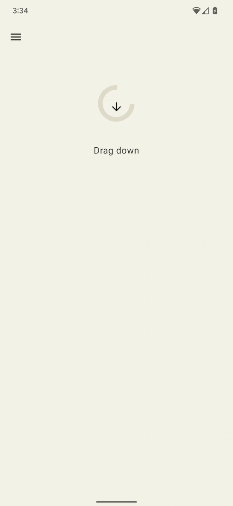
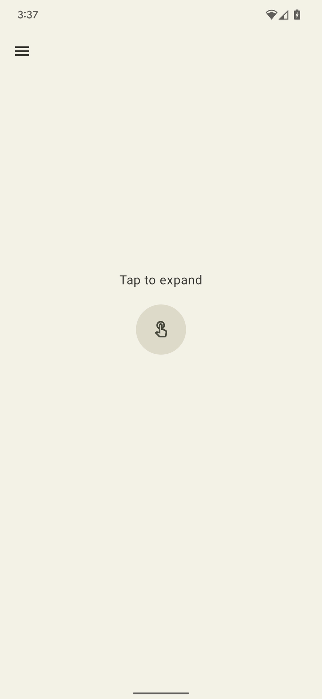
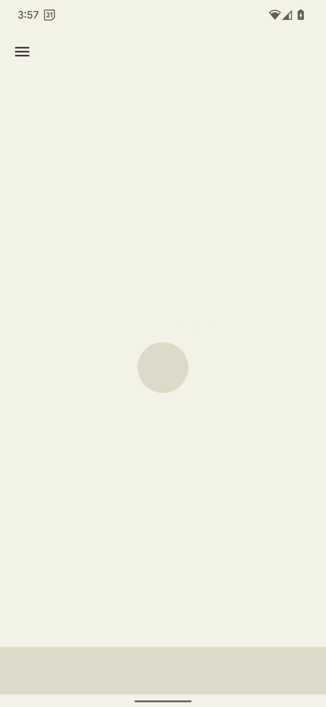
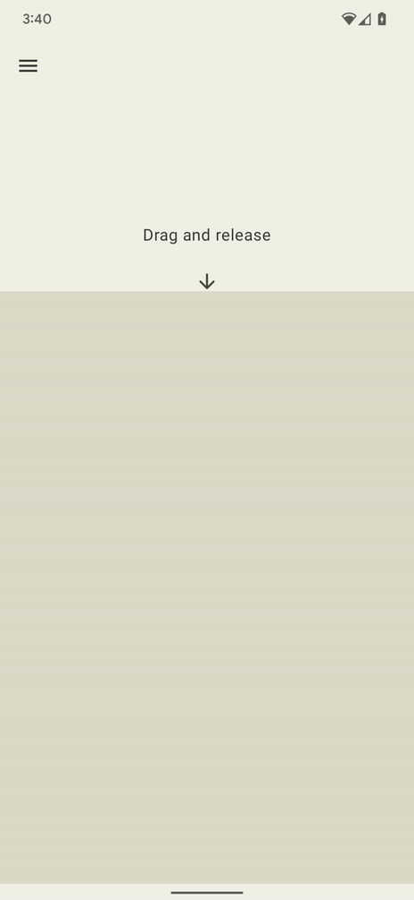

Haptic Sampler
===========================

Android provides wide access to the device vibrator hardware so you can play different
vibration effects and patterns from your app. 

Haptics can enrich your app experience by attracting
the user's attention when it’s required, providing useful feedback to their interactions, and
augmenting audio-visual content with tactile sensations.

The sample is built on top of [Jetpack Compose](https://developer.android.com/jetpack/compose) and requires a recent version of [Android Studio](https://developer.android.com/studio). 

It uses the Gradle build system. To build this project, clone the repo and use the "gradlew build" command or use "Import Project" in Android Studio (***File > New > Import Project***).

> Important Note: Many of the primitives used in this sample are not yet widely available
on Android phones.The app will notify you if the device you are using does not
support the example as intended. 

# Home screen & examples

## Home screen

The home screen contains examples of various vibration effects you can use within your app. In the cases where we know the example will not play on your specific device, we disable the button. On some devices however it is possible that the button will remain enabled but there is no effect.

## Rich haptic effects

The Haptic Sampler application has 4 examples of "rich haptics" built upon a few of the latest 
primitives available in the Android framework. 

### Resist

Controlling the amplitude of the primitive vibration can be used to convey 
useful feedback to an action in progress. Closely-spaced scale values can be
used to create a smooth crescendo effect of a primitive.
The delay between consecutive primitives can also be dynamically set based on
the user interaction. 

In this example as the user pulls down we simulate
resistance by increasing the intensity and reducing the duration between
vibration effects.



### Expand

There are two primitives for ramping up the perceived vibration intensity: 
the PRIMITIVE_QUICK_RISE and PRIMITIVE_SLOW_RISE. 
They both reach the same target, but with different durations. There is only one 
primitive for ramping down, the PRIMITIVE_QUICK_FALL. These primitives work 
better together to create a waveform segment that grows in intensity and 
then dies off. You can align scaled primitives to prevent sudden jumps in
amplitude between them, which also works well for extending the overall effect 
duration. Perceptually, people always notice the rising portion more than the
falling portion, so making the rising portion shorter than the falling can
be used to shift the emphasis towards the falling portion.

This example uses an expanding and collapsing circle with haptics to enhance
the feeling of expansion and collapsing with an added tick to sharpen that the
animation has ended.



### Bounce

This example showcases the the PRIMITIVE_THUD as an example of using vibration
effects to simulate physical interactions. In the example the ball drops with
multiple bounces, playing the primitive at a decreased intensity each time.



### Wobble

This example show cases how you can use the PRIMITIVE_SPIN to delight users
with a wobbling effect. The elastic shape bounces back after being dragged
down, applying a pair of spin effects with varying intensities proportional to
how far you drag down.

As alluded to above, this primitive is most effective when it is
called more than once. Multiple spins concatenated can create a wobbling
and unstable effect, which can be further enhanced by applying a somewhat 
random scaling on each primitive. You can also experiment with the gap between 
successive spin primitives. Two spins without any gap (0 ms in between) creates
a tight spinning sensation while increasing the inter-spin gap from 10 to 50 ms leads
to a looser spinning sensation.



## Support

- Stack Overflow: http://stackoverflow.com/questions/tagged/android

If you've found an error in this sample, please file an issue:
https://github.com/android/user-interface

Patches are encouraged, and may be submitted by forking this project and
submitting a pull request through GitHub. Please see CONTRIBUTING.md for more details.

## License
```
/*
* Copyright (C) 2022 The Android Open Source Project
*
* Licensed under the Apache License, Version 2.0 (the "License");
* you may not use this file except in compliance with the License.
* You may obtain a copy of the License at
*
*     https://www.apache.org/licenses/LICENSE-2.0
*
* Unless required by applicable law or agreed to in writing, software
* distributed under the License is distributed on an "AS IS" BASIS,
* WITHOUT WARRANTIES OR CONDITIONS OF ANY KIND, either express or implied.
* See the License for the specific language governing permissions and
* limitations under the License.
  */
```