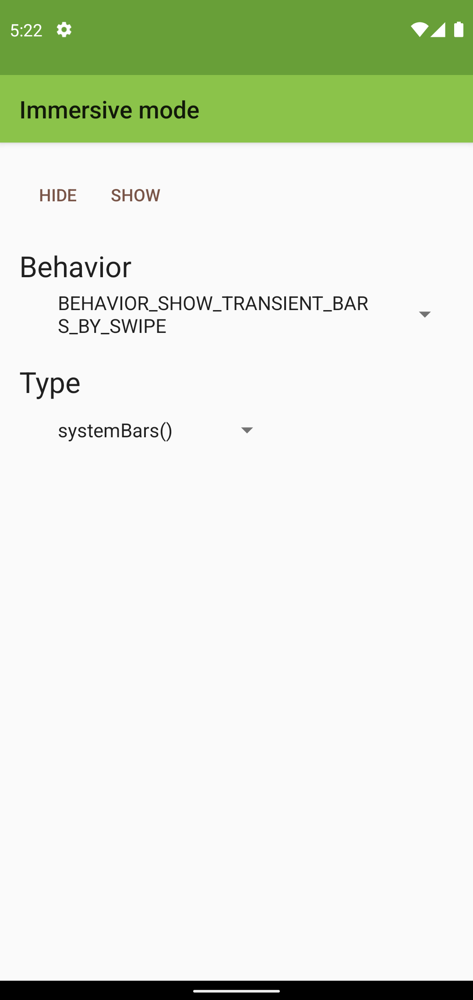

Android ImmersiveMode Sample
============================

"Immersive mode" is intended for apps in which users will be heavily interacting with the screen.
With this API, apps can hide the status bar, the navigation bar, or both. When users need to bring
back the system bars, they swipe from any edge where a system bar is hidden.

"Immersive mode" was originally introduced in Android 4.4 KitKat (API level 19).
[View.setSystemUiVisibility][1] and other APIs provided ability to toggle visibility of System UI
windows, such as the status bar and the navigation bar. The API was overhauled in Android 11 (API
level 30), and apps can now use [WindowInsetsController][2] and other APIs to control the behavior
and visibility of System UI windows that affect [WindowInsets][3]. Alternatively, apps can use
[WindowInsetsControllerCompat][4] to implement this feature in a backward-compatible manner.

[1]: https://developer.android.com/reference/android/view/View#setSystemUiVisibility(int)
[2]: https://developer.android.com/reference/android/view/WindowInsetsController
[3]: https://developer.android.com/reference/android/view/WindowInsets
[4]: https://developer.android.com/reference/androidx/core/view/WindowInsetsControllerCompat

Screenshot
----------

Getting Started
---------------

This sample uses the Gradle build system. To build this project, use the
"gradlew build" command or use "Import Project" in Android Studio.

Support
-------

- Stack Overflow: http://stackoverflow.com/questions/tagged/android

If you've found an error in this sample, please file an issue:
https://github.com/android/user-interface

Patches are encouraged, and may be submitted by forking this project and
submitting a pull request through GitHub. Please see CONTRIBUTING.md for more details.
