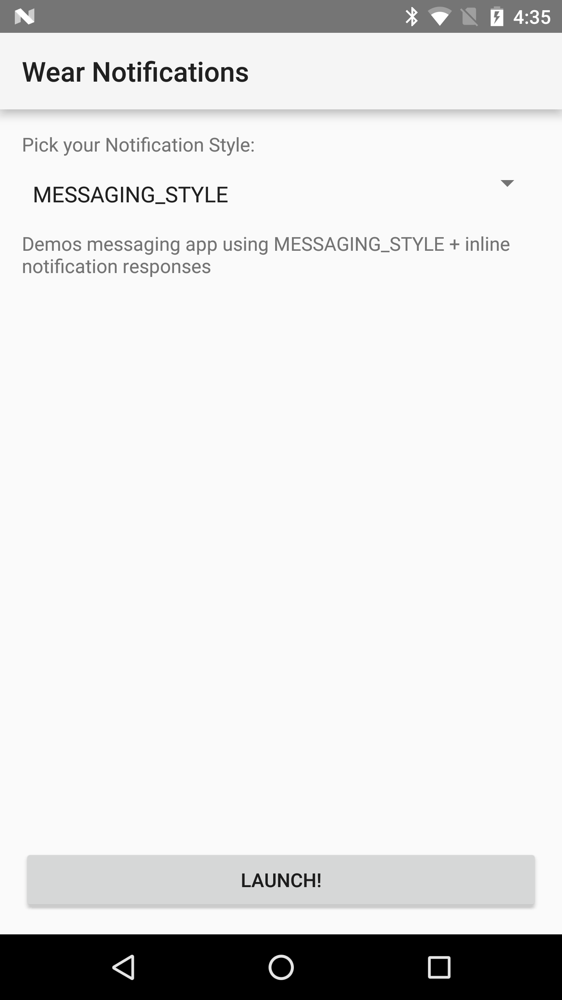
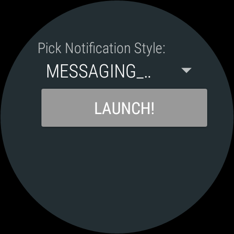

Android Notifications Sample
================================

Sample demonstrates best practices for using NotificationStyle Notifications (Inbox, BigPicture, BigText, and Messaging) for both Mobile apps and native/local Wear apps. It also covers Notifications on Wear 1.+ and Wear 2.0.

Introduction
------------

Steps for trying out the sample:
* Compile and install the mobile app onto your mobile device or emulator (for mobile
scenario).
* Compile and install the wearable app onto your Wear device or emulator (for Wear
scenario).

This sample demonstrate best practices for using [NotificationStyle][1]
[Notifications][2] for two scenarios:

1. Launching Notifications from a Mobile app WITHOUT a native Wear app.
Notifications appear both on mobile and Wear (bridged to appear like a local/native
Wear app).

2. Launching Notifications from a Native/Local Wear app. Notifications only
appear on Wear device.

The Mobile and Wear apps demonstrate [BigTextStyle][3], [BigPictureStyle][4],
[InboxStyle][5], and [MessagingStyle][6] Notifications.

Although there are two apps (Mobile and Wear) running, each should be looked at as a
separate experience. That is, neither app uses nor relies on the other.

They are packaged together simply to show both scenarios in one easy sample.

Both apps also cover the Notifications being displayed on Wear 1.+ and/or Wear 2.0 and
using some of the new features of Wear 2.0 (inline actions).

[1]: https://developer.android.com/reference/android/support/v4/app/NotificationCompat.Style.html
[2]: https://developer.android.com/reference/android/support/v4/app/NotificationCompat.html
[3]: https://developer.android.com/reference/android/support/v4/app/NotificationCompat.BigTextStyle.html
[4]: https://developer.android.com/reference/android/support/v4/app/NotificationCompat.BigPictureStyle.html
[5]: https://developer.android.com/reference/android/support/v4/app/NotificationCompat.InboxStyle.html
[6]: https://developer.android.com/reference/android/support/v4/app/NotificationCompat.MessagingStyle.html

Pre-requisites
--------------

- Android SDK 29
- Android Build Tools
- Android Support Repository

Screenshots
-------------

    

Getting Started
---------------

This sample uses the Gradle build system. To build this project, use the
"gradlew build" command or use "Import Project" in Android Studio.

Support
-------

- Stack Overflow: http://stackoverflow.com/questions/tagged/android

If you've found an error in this sample, please file an issue:
https://github.com/android/user-interface-samples

Patches are encouraged, and may be submitted by forking this project and
submitting a pull request through GitHub. Please see CONTRIBUTING.md for more details.
