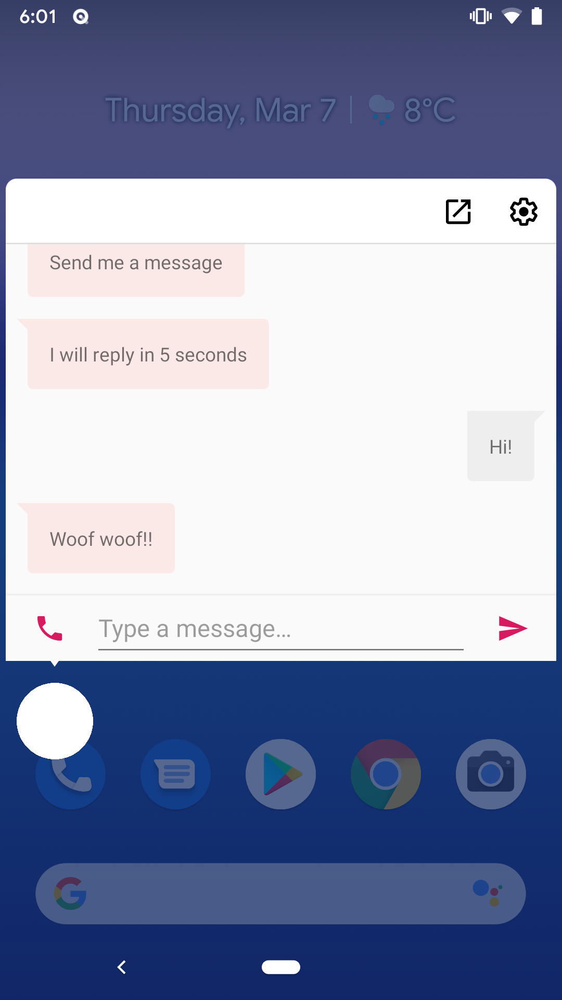
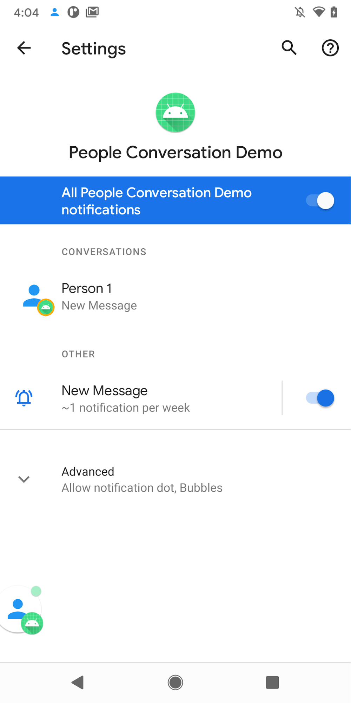

Android People Sample
=====================

Android 11 makes a number of improvements to the way conversations are handled.

## Conversation notifications

Conversations are real-time bidirectional communication among two or more people. On Android 11,
conversations are presented in their own are in the notification shade.

In order to make a notification considered conversational, use [MessagingStyle][1] and publish
[people][2] as shortcuts by calling [ShortcutManager.setDynamicShortcuts][3]. It is also recommended
that you set a [LocusId][4] to the notification so that the system can correlate this notification
with the corresponding dynamic shortcut.

[1]: https://developer.android.com/reference/android/app/Notification.MessagingStyle
[2]: https://developer.android.com/reference/android/app/Person
[3]: https://developer.android.com/reference/android/content/pm/ShortcutManager#addDynamicShortcuts(java.util.List%3Candroid.content.pm.ShortcutInfo%3E)
[4]: https://developer.android.com/reference/android/content/pm/ShortcutInfo.Builder#setLocusId(android.content.LocusId)

## Bubbles

Bubbles are built into the Notification system. They float on top of other app content and follow
the user wherever they go. Bubbles can be expanded to reveal app functionality and information, and
can be collapsed when not being used.

### API Guidelines

#### Conversation Requirements
First fulfill the notification [conversation requirements][5] -- this involves implementing long-lived dynamic or [sharing shortcuts][6] and attaching the shortcut id to your messaging style notification.

#### Configure Activity

For your activity to display as a bubble, it must be resizable. You should expect that the bubble activity will be flagged to act like [documentLaunchMode=”always”][7].

    <activity
        android:name=".bubbles.BubbleActivity"
        android:label="@string/title_activity_bubble"
        android:resizeableActivity="true"
    />

#### Create your Bubble Metadata

Define your [BubbleMetadata][8], defining the properties relevant to your bubble (e.g. The activity used in the expanded bubble, size, auto-expanded and etc...) and [set it on your notification][9].

For more information on bubbles, see the [Bubbles][10] developer guide.

[5]: https://developer.android.com/preview/features/conversations
[6]: https://developer.android.com/training/sharing/receive#providing-direct-share-targets
[7]: https://developer.android.com/guide/topics/manifest/activity-element#dlmode
[8]: https://developer.android.com/reference/androidx/core/app/NotificationCompat.BubbleMetadata.Builder
[9]: https://developer.android.com/reference/kotlin/androidx/core/app/NotificationCompat.Builder#setBubbleMetadata(androidx.core.app.NotificationCompat.BubbleMetadata)
[10]: https://developer.android.com/preview/features#bubbles_enabled

## Pre-requisites

- Android 11 SDK

Android 10 supported Bubbles as a developer-preview feature, but this sample only supports Bubbles
on Android 11 or later.

## Screenshots

 

## Getting Started

This sample uses the Gradle build system. To build this project, use the
"gradlew build" command or use "Import Project" in Android Studio.

## FAQ

### Bubbles

**Q. How can one determine within an activity, that it is in an expanded bubble?**

```
    class BubbleActivity : AppCompatActivity() {
      override fun onCreate(...) {
      ...
      val displayId = this.display.displayId
      val isBubbled = displayId != Display.DEFAULT_DISPLAY
      ...
     } 
   }
```

### Conversation Notifications

**Q: Which notifications are categorized as a conversation notification?**\
A: A notification using [MessagingStyle](https://developer.android.com/reference/android/app/Notification.MessagingStyle) and [setShortcutId()](https://developer.android.com/reference/androidx/core/app/NotificationCompat.Builder#setShortcutId(java.lang.String)) with a [long-lived](https://developer.android.com/reference/androidx/core/content/pm/ShortcutInfoCompat.Builder#setLongLived(boolean)), [dynamic](https://developer.android.com/guide/topics/ui/shortcuts/creating-shortcuts#dynamic) or [sharing shortcut](https://developer.android.com/training/sharing/receive#sharing-shortcuts-api). We strongly recommended using sharing shortcuts as it will eventually be enforced; these type of shortcuts allow the system to drive a more cohesive people focused experience for Android 11 and beyond.

**Q: Can users remove notifications from the conversation section?**\
A: Yes, users can demote a conversation notification from the settings page. This will not affect other conversations notifications from the same app. (See notification channel section for details)

**Q: Is it recommended to publish all DMs as conversation notifications? I.e: some chats are muted by the user in the app, what’s Google’s guidance?**\
A: Still recommend publishing the shortcut since users may want it to surface on the system Share Sheet and other surfaces, but [silence](https://developer.android.com/reference/androidx/core/app/NotificationCompat.Builder#setNotificationSilent()) or don’t post the notification respect the user's preference. 

**Q: How does Android prevent abuse of devs taking advantage of the conversation space?**\
A: Play policy for the shortcut and MessagingStyle APIs are in place, with reactive reinforcement for violations.

### Shortcuts

**Q: What if I have already reached the shortcut [max](https://developer.android.com/reference/android/content/pm/ShortcutManager#getMaxShortcutCountPerActivity()) limit?**\
A: It’s recommended to use [ShortcutManager#pushDynamicShortcut()](https://developer.android.com/reference/android/content/pm/ShortcutManager#pushDynamicShortcut(android.content.pm.ShortcutInfo)) to publish the shortcut before sending notification, as it works around the max shortcut limit; the lowest ranked shortcut will be deleted to publish this shortcut automatically. See this doc for details.

**Q: Are there any plans to increase the max count of shortcuts?**\
A: Currently no, due to memory cost of storing shortcuts (especially icon bitmap)

**Q: Will my shortcuts appear in the long press app launcher context menu?**\
A: They can depending on their rank, but if you prefer not having shortcuts appear on launcher you can remove the shortcut with [ShortcutManager#removeDynamicShortcuts()](https://developer.android.com/reference/androidx/core/content/pm/ShortcutManagerCompat#removeDynamicShortcuts(android.content.Context,%20java.util.List%3Cjava.lang.String%3E)) or [#removeAllDynamicShortcuts()](https://developer.android.com/reference/androidx/core/content/pm/ShortcutManagerCompat#removeAllDynamicShortcuts(android.content.Context)) after sending the notification. You can also [rank](https://developer.android.com/reference/androidx/core/content/pm/ShortcutInfoCompat.Builder#setRank(int)) other app shortcuts with higher ranking, so only those dynamic shortcuts appear on launcher. 

**Q: Will my [shortcuts](https://developer.android.com/reference/androidx/core/content/pm/ShortcutInfoCompat.Builder#setRank(int)) be accessible to 3P apps?**
A: No but with the exception that shortcuts are available to the user's current launcher, as the launcher can be used to show and open them. Shortcuts are also not published to the cloud.

**Q: How do I control my launcher shortcuts?**
Long-pressing on an app icon in the launcher will surface relevant static and currently published dynamic shortcuts by that app.

The launcher shortcut menu for an app may be composed of:
1. [Static shortcuts](https://developer.android.com/guide/topics/ui/shortcuts/creating-shortcuts#static) (always displayed, sometimes capped to a max of 3).
2. Highly [ranked](https://developer.android.com/reference/androidx/core/content/pm/ShortcutInfoCompat.Builder#setRank(int)) dynamic shortcuts, filling in remaining spaces not taken by static shortcuts.
3. Associated notifications notifications for the app.

Publishing dynamic shortcuts via ([ShortcutManager#setDynamicShortcuts()](https://developer.android.com/reference/android/content/pm/ShortcutManager.html#setDynamicShortcuts(java.util.List%3Candroid.content.pm.ShortcutInfo%3E)), [#addDynamicShortcuts()](https://developer.android.com/reference/android/content/pm/ShortcutManager.html#addDynamicShortcuts(java.util.List%3Candroid.content.pm.ShortcutInfo%3E)) or [#pushDynamicShortcut()](https://developer.android.com/reference/android/content/pm/ShortcutManager.html#pushDynamicShortcut(android.content.pm.ShortcutInfo))) may make it appear in the list of available shortcuts in the launcher, visible on long-press. Apps should maintain the published shortcuts by removing the dynamic shortcuts which are not intended to be present in the launcher. See question on "How should I maintain my dynamic shortcuts and handle back compat".

**Q. How should I maintain my dynamic shortcuts and handle back compat?**\
It’s important to ensure your list of published dynamic shortcuts, available with [ShortcutManagerCompat#getDynamicShortcuts()](https://developer.android.com/reference/kotlin/androidx/core/content/pm/ShortcutManagerCompat#getdynamicshortcuts), is intentional and maintained. 

There are two main features that use these published dynamic shortcuts, back to Android 7.1:
The available dynamic shortcuts, in addition to their publishing order and [rank](https://developer.android.com/reference/androidx/core/content/pm/ShortcutInfoCompat.Builder#setRank(int)) may determine what’s presented to users. Active maintenance is required to ensure the list of shortcuts is as you intend. See discussion of the individual features below.

There may be circumstances where you do not want to change the list of dynamic shortcuts but do want to temporarily ensure a shortcut is available to the OS. This might be the case, for example, before posting a Conversation Notification that requires a valid Conversation Shortcut.

To ensure the shortcut is available to the OS temporarily, try the following:
1. Ensure the shortcut you intended to publish isn’t already cached via [ShortcutManagerCompat#getShortcuts(FLAG_MATCH_CACHED)](https://developer.android.com/reference/kotlin/androidx/core/content/pm/ShortcutManagerCompat#getShortcuts(android.content.Context,%20kotlin.Int)) or published via #getDynamicShortcuts(). If it is, no further action is needed.
2. Save the list of currently published shortcut IDs via [#getDynamicShortcuts()](https://developer.android.com/reference/kotlin/androidx/core/content/pm/ShortcutManagerCompat#getdynamicshortcuts).
3. Add the the shortcuts you need to be temporarily available via #setDynamicShortcuts() or related APIs.
4. Perform the task needed, like posting a Conversation Notification.
5. Recreate and republish the the dynamic shortcuts from step 2 with [#setDynamicShortcuts()](https://developer.android.com/reference/kotlin/androidx/core/content/pm/ShortcutManagerCompat#setdynamicshortcuts) or related APIs.

### System Sharesheet backcompat

The system Sharesheet shows users a list of deep-linked targets, called Direct Share. Tapping usually opens the associated app directly to the associated conversation.

There are two ways to publish Direct Share targets:
Via | Introduced
--- | -------------
[Sharing Shortcuts](https://developer.android.com/training/sharing/receive#providing-direct-share-targets) | Android 10, API level 29
[ChooserTargetService](https://developer.android.com/reference/android/service/chooser/ChooserTargetService) (deprecated) | Android 6, API level 23

Dynamically published Sharing Shortcuts will appear in the Android 10 Sharesheet. Dynamic and cached sharing Shortcuts will appear in Android 11. Be sure to manage your list of published dynamic shortcuts so that the list includes intentional sharing suggestions.

To have Conversation Shortcuts appear in the Sharesheet on devices from Android 6-9 you may either:
* Use the [compat library](https://developer.android.com/training/sharing/receive#androidx-compat-library) to generate a [ChooserTargetService](https://developer.android.com/reference/android/service/chooser/ChooserTargetService) which converts and provides dynamically published Sharing Shortcuts to ChooserTargets.
* Make your own [ChooserTargetService](https://developer.android.com/reference/android/service/chooser/ChooserTargetService).

### Converting existing pinned shortcuts to Conversation Shortcuts

Your app may already be using shortcuts to show items in the launcher long-press menu. Users can drag these shortcuts to their launcher homescreen. Likewise, your app may expose the ability for users to post a shortcut directly to their launcher from within your app. If done, the shortcut can appear as a stand-alone target in the user’s launcher homescreen. In both cases, when a shortcut appears in a stand-alone fashion in the launcher it becomes pinned.

To support Conversation Notifications and Conversation Shortcuts you may want to convert existing pinned shortcuts to Conversation Shortcuts. 

To ensure shortcuts your users have already placed on their launcher home screen remain active and use the new API you must post an updated Conversation Shortcut with the same id as pinned shortcuts accessible via [ShortcutInfo#getId()](https://developer.android.com/reference/android/content/pm/ShortcutInfo#getId()).
1. Make all necessary internal updates to support Conversation Shortcuts
2. For each pinned shortcut: create and publish a new [ShortcutInfo](https://developer.android.com/reference/android/content/pm/ShortcutInfo) with the same id as the pinned shortcut

### Notification Channels

**Q: When users change a conversation notification preference: importance, does this apply to all notifications or per conversation?**\
A: This will be per conversation, a derived conversation channel will be created when the user changes the notification preferences. 

**Q: How will the derived conversation channel be presented on the settings page?**\
A: Derivative channels generated per-conversation for Conversation Notifications will appear in a section distinct from other channels in system settings for your app’s notifications.

 

Here is a screenshot of the current WIP Notification Settings for an app where a derivative conversation channel was generated.

**Q: Can apps access user preferences of the conversation notifications like importance?**\
A: Apps can retrieve the notification settings with [getNotificationChannel()](https://developer.android.com/reference/android/app/NotificationManager#getNotificationChannel(java.lang.String,%20java.lang.String)) and access importance via [NotificationChannel#isImportantConversation()](https://developer.android.com/reference/android/app/NotificationChannel#isImportantConversation()).

**Q: Will a deleted conversation channel count against the app deleted channel count?**\
A: Yes, deleted conversation channels will be counted. 

### AndroidX support

**Q: Does the compat libs cover the APIs surfaces to implement people conversation feature?**\
A: 
For Bubbles and sharing shortcuts, there is some compat library support. But there is no plan for backwards compatibility to bring Bubbles to Android devices prior to version 11.

For Notifications, yes the existing stable compat libraries cover all required cases. 

For Shortcuts, the existing stable compat libraries cover all the needed APIs except, [ShortcutManager#removeLongLivedShortcuts()](https://developer.android.com/reference/android/content/pm/ShortcutManager#removeLongLivedShortcuts(java.util.List%3Cjava.lang.String%3E)) which can be used to remove a cached shortcut when a given conversation is blocked, deleted, etc. There are several recommended steps to help increase the rank of your shortcuts for which the compat libraries are not yet published.
For notification channel, APIs to [set](https://developer.android.com/reference/android/app/NotificationChannel#setConversationId(java.lang.String,%20java.lang.String)) conversation channels and query whether it’s important are not available in compat lib yet.

### Other

**Q: What is the OEM adoption of the people conversation feature?**\
A: The conversations space itself is required to be implemented for OEM partners that incorporate the Google Mobile Services and strongly recommended for all Android OEMs for their Android 11 releases. We are working with some of the major OEMs that are actively working on the implementation. Not all functions of the conversation space of ASOP are required.

## Support

- Stack Overflow: http://stackoverflow.com/questions/tagged/android

If you've found an error in this sample, please file an issue:
https://github.com/android/user-interface

Patches are encouraged, and may be submitted by forking this project and
submitting a pull request through GitHub. Please see CONTRIBUTING.md for more details.
