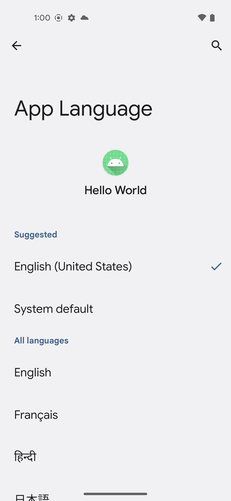
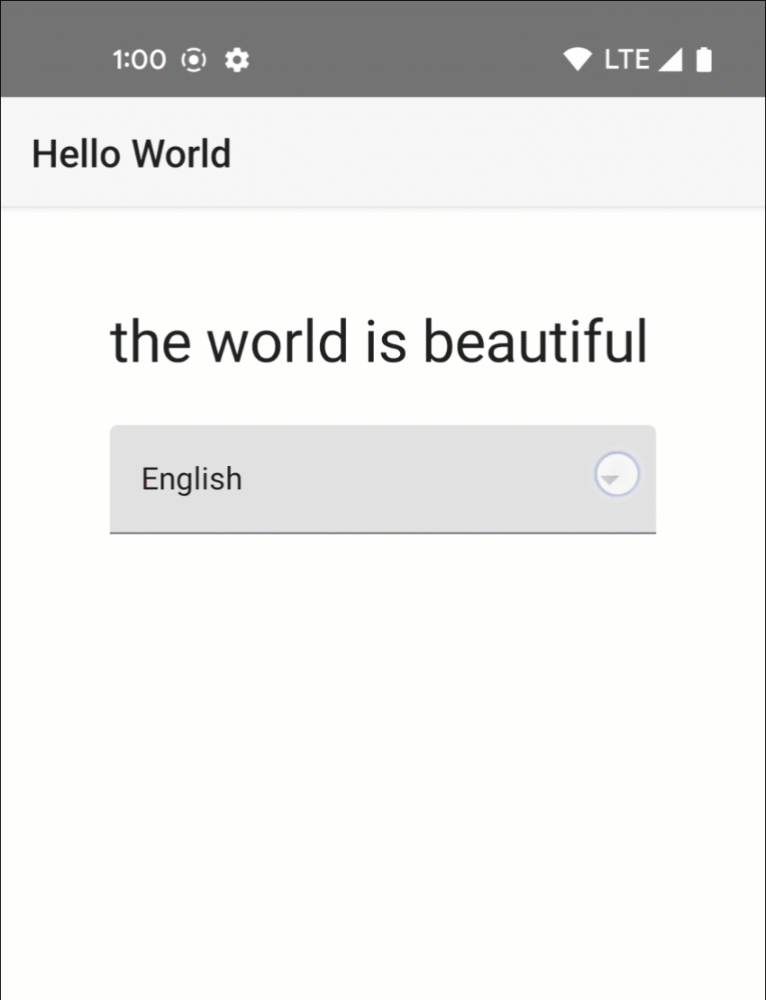

# Per-App Language Preferences Sample

This Compose sample demonstrates how to use the new [Per-App Language Preferences](https://developer.android.com/about/versions/13/features/app-languages) APIs introduced in API level 33. The new set of APIs allows an application language to be different from the system language.

## Allow users to change your app language in their phone settings [(docs)](https://developer.android.com/about/versions/13/features/app-languages#app-language-settings)

Android 13 adds a centralized location in phone settings for setting per-app language preferences. To ensure your app's languages are configurable in system settings on devices running Android 13, create a `locales_config` XML file and add it your app's manifest using the `android:localeConfig` attribute.

1. Create a file called res/xml/locales_config.xml, and specify your app’s languages:

```
<?xml version="1.0" encoding="utf-8"?>
<locale-config xmlns:android="http://schemas.android.com/apk/res/android">
   <locale android:name="ja"/>
   <locale android:name="fr"/>
   <locale android:name="en"/>
</locale-config>
```

In the manifest, add a line pointing to this new file:
```
<manifest
    ...
    <application
    ...
        android:localeConfig="@xml/locales_config">
    </application>
</manifest>
```



## Allow users to change your app language directly in your app [(docs)](https://developer.android.com/about/versions/13/features/app-languages#api-implementation)

Call the backwards compatible [setApplicationLocales()](https://developer.android.com/reference/androidx/appcompat/app/AppCompatDelegate#setApplicationLocales(androidx.core.os.LocaleListCompat)) method to change your app locale at runtime.

```
val appLocale: LocaleListCompat = LocaleListCompat.forLanguageTags("xx-YY")
AppCompatDelegate.setApplicationLocales(appLocale)
```

Delegate the user's locale preference pre Android T.

```
<application
  ...
  <service
    android:name="androidx.appcompat.app.AppLocalesMetadataHolderService"
    android:enabled="false"
    android:exported="false">
    <meta-data
      android:name="autoStoreLocales"
      android:value="true" />
  </service>
  ...
</application>
```



### Resources

+ [Developer documentation](https://developer.android.com/about/versions/13/features/app-languages)
+ [DroidconSF talk](https://www.droidcon.com/2022/06/28/android-app-internationalization-users-can-now-choose-their-application-language/)

# Getting Started

This sample uses the Gradle build system. To build this project, use the
"gradlew build" command or use "Import Project" in Android Studio.

# Support

If you've found an error in this sample, please file an issue:
https://github.com/android/user-interface

Patches are encouraged, and may be submitted by forking this project and
submitting a pull request through GitHub. Please see CONTRIBUTING.md for more details.
