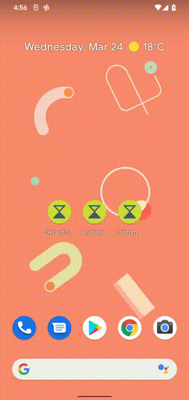

Android SplashScreen Sample
===========================

Android 12 adds the new SplashScreen API that allows developers to add a customized animated screen
at the app launch.

## Introduction

Showing a splash screen is an effective way to improve the perceived performance of an app launch.
With the SplashScreen API introduced in Android 12, apps can specify an animated icon to be shown
on its splash screen.

You can use an [animated vector drawable][1] as the splash screen icon by specifying it as
[android:windowSplashScreenAnimatedIcon][2] in your activity theme. You can also specify the
background color with [android:windowSplashScreenBackground][3], the animation duration with
[android:windowSplashScreenAnimationDuration][4], and the optional branding image with
[android:windowSplashScreenBrandingImage][5]

[1]: https://developer.android.com/reference/android/graphics/drawable/AnimatedVectorDrawable
[2]: https://developer.android.com/reference/android/R.attr#windowSplashScreenAnimatedIcon
[3]: https://developer.android.com/reference/android/R.attr#windowSplashScreenBackground
[4]: https://developer.android.com/reference/android/R.attr#windowSplashScreenAnimationDuration
[5]: https://developer.android.com/reference/android/R.attr#windowSplashScreenBrandingImage

You can further customize the animation of the splash screen through [Activity.getSplashScreen][6].
Use [setOnExitAnimationListener][7] to add a callback that's called when the splash screen is
animating to the app content. There, you can create and run your own animation. The callback gives
you the [SplashScreenView][8], and from there, you can get a reference to the icon view.

[6]: https://developer.android.com/reference/android/app/Activity#getSplashScreen()
[7]: https://developer.android.com/reference/android/window/SplashScreen#setOnExitAnimationListener(android.window.SplashScreen.OnExitAnimationListener)
[8]: https://developer.android.com/reference/android/window/SplashScreenView

## About the sample

This sample exports 3 launcher icons.

- "Default Splash Screen" shows the default splash screen without any customization.
- "Animated Splash Screen" shows an animated icon on the splash screen.
- "Custom Splash Screen" shows the splash screen with a custom animation to the app content.

## Pre-requisites

- Android 12 SDK

## Screenshots

## Getting Started

This sample uses the Gradle build system. To build this project, use the
"gradlew build" command or use "Import Project" in Android Studio.

## Support

- Stack Overflow: http://stackoverflow.com/questions/tagged/android

If you've found an error in this sample, please file an issue:
https://github.com/android/user-interface

Patches are encouraged, and may be submitted by forking this project and
submitting a pull request through GitHub. Please see CONTRIBUTING.md for more details.
