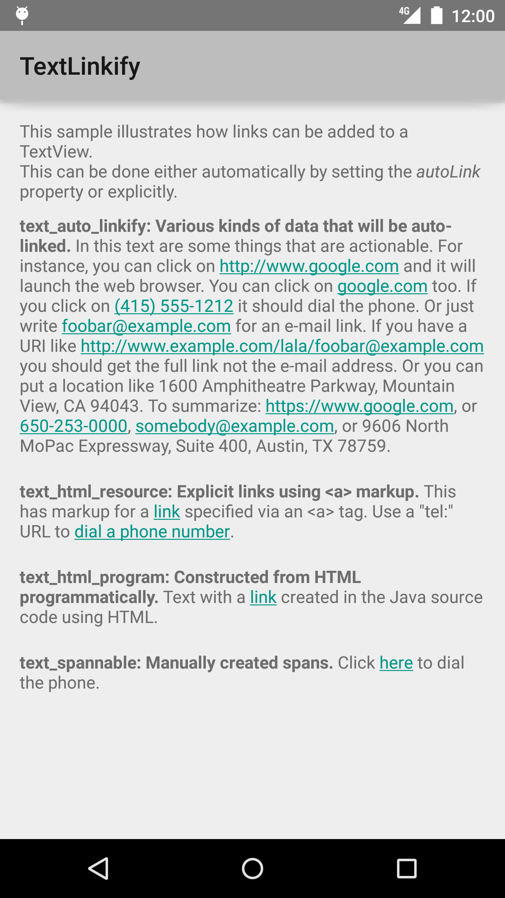

Android TextLinkify Sample
===================================

This sample illustrates how links can be added to a TextView. This can be done either
automatically by setting the "autoLink" property or explicitly.

Introduction
------------

This sample demonstrates how clickable links can be added to a `TextView` in Android.

This can be done in three ways:

- **Automatically:** Text added to a TextView can automatically be linkified by enabling
autoLinking. In XML, use the `android:autoLink` property, programatically call
[android.widget.TextView#setAutoLinkMask(int)][1] using an option from
[android.text.util.Linkify][2].
- **Parsing a String as HTML:** See [android.text.Html#fromHtml(String)][3].
- **Manually by constructing a [android.text.SpannableString][4]:** Consisting of
[android.text.style.StyleSpan][5] and [android.text.style.URLSpan][6] objects that
are contained within a [android.text.SpannableString][7].

[1]: http://developer.android.com/reference/android/widget/TextView.html#setAutoLinkMask(int)
[2]: http://developer.android.com/reference/android/text/util/Linkify.html
[3]: http://developer.android.com/reference/android/text/Html.html#fromHtml(java.lang.String)
[4]: http://developer.android.com/reference/android/text/SpannableString.html
[5]: http://developer.android.com/reference/android/text/style/StyleSpan.html
[6]: http://developer.android.com/reference/android/text/style/URLSpan.html
[7]: http://developer.android.com/reference/android/text/SpannableString.html

Pre-requisites
--------------

- Android SDK 28
- Android Build Tools v28.0.3
- Android Support Repository

Screenshots
-------------

 

Getting Started
---------------

This sample uses the Gradle build system. To build this project, use the
"gradlew build" command or use "Import Project" in Android Studio.

Support
-------

- Stack Overflow: http://stackoverflow.com/questions/tagged/android

If you've found an error in this sample, please file an issue:
https://github.com/android/user-interface

Patches are encouraged, and may be submitted by forking this project and
submitting a pull request through GitHub. Please see CONTRIBUTING.md for more details.
