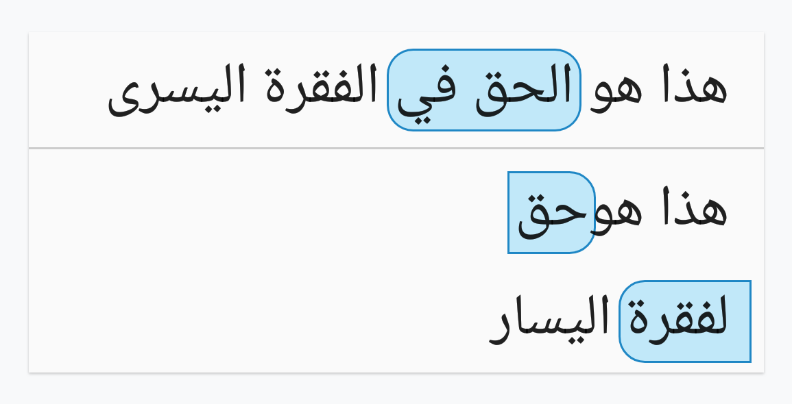

Drawing a rounded corner background on text
============

This sample shows how to draw a **rounded** corner background on text. It supports the following cases:

* Set the background on **one line** text


* Set the background on text over **two or multiple lines**


* Set the background on **right-to-left** text




Implementation
---------------
Depending on the position of the text, we need to draw four different drawables as text backgrounds:

* Text fits on one line: we only need one drawable
* Text fits on 2 lines: we need drawables for the start and end of the text
* Text spans multiple lines: we need drawables for the start, middle and end of the text


The four drawables that need to be drawn depending on the position of the text:

To position the background, we need to:
* Determine whether the text spans multiple lines
* Find the start and end lines
* Find the start and end offset depending on the paragraph direction

All of these can be computed based on the text Layout. To render the background behind the text we need access to the Canvas. A custom TextView has access to all of the information necessary to position the drawables and render them.

Our solution involves splitting our problem into 4 parts and creating classes dealing with them individually:
* **Marking the position of the background** is done in the XML resources via Annotation spans and then, in the code, we read them in the `TextRoundedBgHelper`
* Providing the background **drawables as attributes** of the TextView - implemented in `TextRoundedBgAttributeReader`
* **Rendering the drawables** depending on whether the text runs across **one or multiple lines** - `TextRoundedBgHelper` interface and its implementations: `SingleLineRenderer` and `MultiLineRenderer`
* Supporting **custom drawing** on a TextView - `RoundedBgTextView`, a class that extends `AppCompatTextView`, reads the attributes with the help of `TextRoundedBgAttributeReader`, overrides `onDraw` where it uses `TextRoundedBgHelper` to draw the background.

Getting Started
---------------

Clone this repository, enter the top level directory and run `./gradlew tasks`
to get an overview of all the tasks available for this project.

Some important tasks are:

```
assembleDebug - Assembles all Debug builds.
installDebug - Installs the Debug build.
connectedAndroidTest - Installs and runs the tests for Debug build on connected
devices.
test - Run all unit tests.
```

Screenshots
-----------


Support
-------
- Stack Overflow: http://stackoverflow.com/questions/tagged/android-text

If you've found an error in this sample, please file an issue:
https://github.com/android/user-interface/issues

Patches are encouraged, and may be submitted by forking this project and
submitting a pull request through GitHub.
