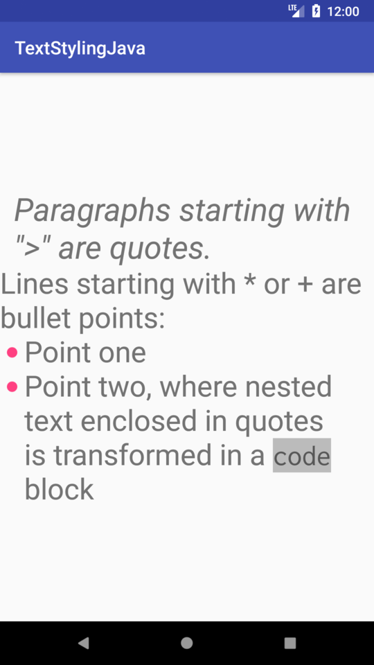

Text Styling
============
This sample shows how to style text on Android using spans, in Kotlin, using [Android KTX](https://github.com/android/android-ktx).

Introduction
------------
## Features
Parse some hardcoded text and do the following:
* Paragraphs starting with “> ” are transformed into quotes.
* Text enclosed in “```” will be transformed into inline code block.
* Lines starting with “+ ” or “* ” will be transformed into bullet points.
To update the text, modify the value of `R.string.display_text`.
This project is not meant to fully cover the markdown capabilities and has several limitations; for example, quotes do not support nesting other elements.

## Implementation
The text is parsed in the [`Parser.parse`](https://github.com/googlesamples/android-text/blob/master/TextStyling-Kotlin/app/src/main/java/com/android/example/text/styling/parser/Parser.kt#L42) method and the spans are created in the [`MarkdownBuilder.markdownToSpans`](https://github.com/googlesamples/android-text/blob/master/TextStyling-Kotlin/app/src/main/java/com/android/example/text/styling/renderer/MarkdownBuilder.kt#L43) method.
To see how to apply one or multiple spans on a string, check out [`MarkdownBuilder.buildElement`](https://github.com/googlesamples/android-text/blob/master/TextStyling-Kotlin/app/src/main/java/com/android/example/text/styling/renderer/MarkdownBuilder.kt#L53). For examples of creating custom spans, see [`BulletPointSpan`](https://github.com/googlesamples/android-text/blob/master/TextStyling-Kotlin/app/src/main/java/com/android/example/text/styling/renderer/spans/BulletPointSpan.kt), [`CodeBlockSpan`](https://github.com/googlesamples/android-text/blob/master/TextStyling-Kotlin/app/src/main/java/com/android/example/text/styling/renderer/spans/CodeBlockSpan.kt) or [`FontSpan`](https://github.com/googlesamples/android-text/blob/master/TextStyling-Kotlin/app/src/main/java/com/android/example/text/styling/renderer/spans/FontSpan.kt).

## Testing
Text parsing is tested with JUnit tests in `ParserTest`. Span building is tested via Android JUnit tests, in `MarkdownBuilderTest`.


Getting Started
---------------

Clone this repository, enter the top level directory and run `./gradlew tasks`
to get an overview of all the tasks available for this project.

Some important tasks are:

```
assembleDebug - Assembles all Debug builds.
installDebug - Installs the Debug build.
connectedAndroidTest - Installs and runs the tests for Debug build on connected
devices.
test - Run all unit tests.
```

Screenshots
-----------


Support
-------
- Stack Overflow: http://stackoverflow.com/questions/tagged/android-text

If you've found an error in this sample, please file an issue:
https://github.com/android/user-interface/issues

Patches are encouraged, and may be submitted by forking this project and
submitting a pull request through GitHub.
