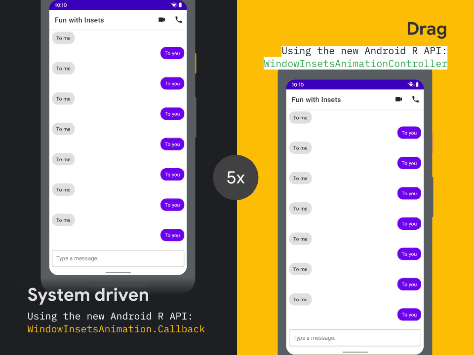

WindowInsetsAnimation sample
============

This sample shows how to react to the on-screen keyboard (IME) changing visibility, and also controlling the IME's visibility. To do this, the sample uses the [WindowInsetsAnimationCompat](https://developer.android.com/reference/androidx/core/view/WindowInsetsAnimationCompat) and [WindowInsetsAnimationControllerCompat][wiac] APIs available in [AndroidX Core][androidxcore] and [Android 11](https://developer.android.com/11).



## Features

The app displays a mock instant-message style conversation, and has two key pieces of functionality:

### #1: Reacting to the IME coming on/off screen (API 21+)

When the IME is displayed due to a implicit event (such as the `EditText` being focused), the UI will react as the IME animates in by moving any relevant views in unison. This creates the effect of the IME pushing the app's UI up. You can see this in the demo above on the right. 

In terms of implementation, this is done using a [`WindowInsetsAnimationCompat.Callback`](https://developer.android.com/reference/androidx/core/view/WindowInsetsAnimationCompat.Callback), which allows views to be notified when an insets animation is taking place. In this sample, we have provided an implementation called [`TranslateDeferringInsetsAnimationCallback`](./app/src/main/java/com/google/android/samples/insetsanimation/TranslateDeferringInsetsAnimationCallback.kt) which automatically moves the host view between it's position before and after the IME visibility change. This is used on both the text field and scrolling views, allowing them both to move in unison with the IME.

#### Graceful degredation
As this feature relies on new APIs, we gracefully degrade the experience as so:

 - When running on devices with API level 30+, this feature perfectly tracks the IME as it enter/exits the screens. 
 - When running on devices with API level 21-29, [`WindowInsetsAnimationCompat`](https://developer.android.com/reference/androidx/core/view/WindowInsetsAnimationCompat) will run an animation which attempts to mimic the system IME animation. This will never be able to perfectly track the IME, but should provide a pleasant experience for users.
 - When running devices with API < 21, the animation won't run at all and will revert back to an instant 'snap'.

### #2: Controlling the IME (API 30+)

When the user scrolls up on the conversation list, to the end of the list's content, and keeps scrolling (aka over-scrolling) the sample takes control of the IME and animates it on/off screen as part of the scroll gesture. You can see this in the demo above on the left, as the IME scrolls on and off screen with the conversation.

In terms of implementation, this is done using the [`WindowInsetsAnimationControllerCompat`][wiac] API available in [AndroidX Core][androidxcore] 1.5.0. A nested scrolling `LinearLayout` which automatically reacts to scrolls by insetting the IME on/off screen is provided in [`InsetsAnimationLinearLayout`](./app/src/main/java/com/google/android/samples/insetsanimation/InsetsAnimationLinearLayout.kt).

A [`View.OnTouchListener`](https://developer.android.com/reference/kotlin/android/view/View.OnTouchListener) implementation, for use with non-scrolling views is also provided as [`InsetsAnimationTouchListener`](./app/src/main/java/com/google/android/samples/insetsanimation/InsetsAnimationTouchListener.kt).

As these APIs are in AndroidX Core, they are available to use on devices back to API < 21, _but_ they only provide functionality on devices with Android 11 or newer.

## Getting Started

Clone this repository, enter the top level directory and run `./gradlew tasks`
to get an overview of all the tasks available for this project.

Some important tasks are:

```
assembleDebug - Assembles all Debug builds.
installDebug - Installs the Debug build.
connectedAndroidTest - Installs and runs the tests for Debug build on connected
devices.
test - Run all unit tests.
```

## Support

If you've found an error in this sample, please file an issue:
https://github.com/android/user-interface/issues

Patches are encouraged, and may be submitted by forking this project and
submitting a pull request through GitHub.

 [androidxcore]: https://developer.android.com/jetpack/androidx/releases/core
 [wiac]: https://developer.android.com/reference/androidx/core/view/WindowInsetsAnimationControllerCompat
